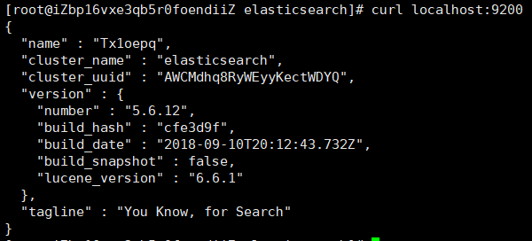

# Docker安装部署使用elasticsearch


前言：本来想装个ELK，结果小服务器内存开销过大跑不动，本来也没什么日志可看，只好凑活着弄个es玩玩。

## 一、Docker部署es及es-head

```
# docker pull elasticsearch
# docker run -d --name myES -p 9200:9200 -p 9300:9300 -e "discovery.type=single-node" elasticsearc
```

启动后发现服务器卡死了，使用docker stats查看容器CPU使用情况，发现ES容器占用了1.2G的内存，只能把它关掉。

1核2G的小服务器想部署ES必须要限制它的内存占用，所以启动时要加上限制内存的参数。

```
# ES较耗费内存
# ES的数据一般需要挂载到安全目录中，需要提前创建好“elasticsearch.yml”文件，如果直接运行命令会被当作文件夹创建

# docker run --name myES -p 9200:9200 -p 9300:9300  -e "discovery.type=single-node" -e ES_JAVA_OPTS="-Xms64m -Xmx256m" -v /home/wxz/elasticsearch/config/elasticsearch.yml:/usr/share/elasticsearch/config/elasticsearch.yml -v /home/wxz/elasticsearch/data:/usr/share/elasticsearch/data -v /home/wxz/elasticsearch/plugins:/usr/share/elasticsearch/plugins -d elasticsearch

# 9200作为Http协议，主要用于外部通讯
# 9300作为Tcp协议，jar之间就是通过tcp协议通讯
# ES集群之间是通过9300进行通讯
# elasticsearch.yml是挂载的配置文件，data是挂载的数据，plugins是es的插件
```

创建成功，访问9200端口检查ES是否正常启动



检查容器的内存使用情况。docker stats


### 安装ElasticSearch Head

```
# docker pull  mobz/elasticsearch-head:5
# docker run -d --name ES-Head -p 9100:9100 mobz/elasticsearch-head:5
```

安装成功后访问http://IP:9100/，连接ES，发现连接失败，是因为有跨域问题，因为前后端分离开发的所以需要设置一下es配置。

```
# vim elasticsearch.yml

# 添加以下内容解决跨域问题，其实就是SpringBoot的yml文件 添加跨域支持
http.cors.enabled: true
http.cors.allow-origin: "*"

# 退出容器并重启
# docker restart es
```

重新访问http://IP:9100/，连接ES，发现连接成功。


## 二、es的基本概念

### 2.1 Node 与 Cluster

Elastic 本质上是一个分布式数据库，允许多台服务器协同工作，每台服务器可以运行多个 Elastic 实例。

单个 Elastic 实例称为一个节点（node）。一组节点构成一个集群（cluster）。

### 2.2 Index

Elastic 会索引所有字段，经过处理后写入一个反向索引（Inverted Index）。查找数据的时候，直接查找该索引。

所以，Elastic 数据管理的顶层单位就叫做 Index（索引）。它是单个数据库的同义词。每个 Index （即数据库）的名字必须是小写。

下面的命令可以查看当前节点的所有 Index。

```
$ curl -X GET 'http://localhost:9200/_cat/indices?v'
```

### 2.3 Document

Index 里面单条的记录称为 Document（文档）。许多条 Document 构成了一个 Index。

Document 使用 JSON 格式表示，下面是一个例子。

```
{
  "user": "张三",
  "title": "工程师",
  "desc": "数据库管理"
}
```

同一个 Index 里面的 Document，不要求有相同的结构（scheme），但是最好保持相同，这样有利于提高搜索效率。

### 2.4 Type

Document 可以分组，比如`weather`这个 Index 里面，可以按城市分组（北京和上海），也可以按气候分组（晴天和雨天）。这种分组就叫做 Type，它是虚拟的逻辑分组，用来过滤 Document。

不同的 Type 应该有相似的结构（schema），举例来说，`id`字段不能在这个组是字符串，在另一个组是数值。这是与关系型数据库的表的[一个区别](https://www.elastic.co/guide/en/elasticsearch/guide/current/mapping.html)。性质完全不同的数据（比如`products`和`logs`）应该存成两个 Index，而不是一个 Index 里面的两个 Type（虽然可以做到）。

下面的命令可以列出每个 Index 所包含的 Type。

```
$ curl 'localhost:9200/_mapping?pretty=true'
```

根据[规划](https://www.elastic.co/blog/index-type-parent-child-join-now-future-in-elasticsearch)，Elastic 6.x 版只允许每个 Index 包含一个 Type，7.x 版将会彻底移除 Type。

## 三、es数据操作命令

> 引用自：
>
> http://www.ruanyifeng.com/blog/2017/08/elasticsearch.html
>
> https://www.elastic.co/guide/en/elasticsearch/reference/6.8/query-dsl.html

### 3.1 新建和删除 Index

新建 Index，可以直接向 Elastic 服务器发出 PUT 请求。下面的例子是新建一个名叫`weather`的 Index。

```
$ curl -X PUT 'localhost:9200/weather'
```

服务器返回一个 JSON 对象，里面的`acknowledged`字段表示操作成功。

```
{
  "acknowledged":true,
  "shards_acknowledged":true
}
```

然后，我们发出 DELETE 请求，删除这个 Index。

```
$ curl -X DELETE 'localhost:9200/weather'
```

### 3.1 新增记录

向指定的 /Index/Type 发送 PUT 请求，就可以在 Index 里面新增一条记录。比如，向`/accounts/person`发送请求，就可以新增一条人员记录。

```
$ curl -X PUT 'localhost:9200/accounts/person/1' -d '
{
  "user": "张三",
  "title": "工程师",
  "desc": "数据库管理"
}' 
```

服务器返回的 JSON 对象，会给出 Index、Type、Id、Version 等信息。

```
{
  "_index":"accounts",
  "_type":"person",
  "_id":"1",
  "_version":1,
  "result":"created",
  "_shards":{"total":2,"successful":1,"failed":0},
  "created":true
}
```

如果你仔细看，会发现请求路径是`/accounts/person/1`，最后的`1`是该条记录的 Id。它不一定是数字，任意字符串（比如`abc`）都可以。

新增记录的时候，也可以不指定 Id，这时要改成 POST 请求。

```
$ curl -X POST 'localhost:9200/accounts/person' -d '
{
  "user": "李四",
  "title": "工程师",
  "desc": "系统管理"
}'
```

上面代码中，向`/accounts/person`发出一个 POST 请求，添加一个记录。这时，服务器返回的 JSON 对象里面，`_id`字段就是一个随机字符串。

```
{
  "_index":"accounts",
  "_type":"person",
  "_id":"AV3qGfrC6jMbsbXb6k1p",
  "_version":1,
  "result":"created",
  "_shards":{"total":2,"successful":1,"failed":0},
  "created":true
}
```

注意，如果没有先创建 Index（这个例子是`accounts`），直接执行上面的命令，Elastic 也不会报错，而是直接生成指定的 Index。所以，打字的时候要小心，不要写错 Index 的名称。

### 3.2 查看记录

向`/Index/Type/Id`发出 GET 请求，就可以查看这条记录。

```
$ curl 'localhost:9200/accounts/person/1?pretty=true'
```

上面代码请求查看`/accounts/person/1`这条记录，URL 的参数`pretty=true`表示以易读的格式返回。

返回的数据中，`found`字段表示查询成功，`_source`字段返回原始记录。

```
{
  "_index" : "accounts",
  "_type" : "person",
  "_id" : "1",
  "_version" : 1,
  "found" : true,
  "_source" : {
    "user" : "张三",
    "title" : "工程师",
    "desc" : "数据库管理"
  }
}
```

如果 Id 不正确，就查不到数据，`found`字段就是`false`。

```
$ curl 'localhost:9200/weather/beijing/abc?pretty=true'

{
  "_index" : "accounts",
  "_type" : "person",
  "_id" : "abc",
  "found" : false
}
```

### 3.3 删除记录

删除记录就是发出 DELETE 请求。

```
$ curl -X DELETE 'localhost:9200/accounts/person/1'
```

这里先不要删除这条记录，后面还要用到。

### 3.4 更新记录

更新记录就是使用 PUT 请求，重新发送一次数据。

```
$ curl -X PUT 'localhost:9200/accounts/person/1' -d '
{
    "user" : "张三",
    "title" : "工程师",
    "desc" : "数据库管理，软件开发"
}' 

{
  "_index":"accounts",
  "_type":"person",
  "_id":"1",
  "_version":2,
  "result":"updated",
  "_shards":{"total":2,"successful":1,"failed":0},
  "created":false
}
```

上面代码中，我们将原始数据从"数据库管理"改成"数据库管理，软件开发"。 返回结果里面，有几个字段发生了变化。

```
"_version" : 2,
"result" : "updated",
"created" : false
```

可以看到，记录的 Id 没变，但是版本（version）从`1`变成`2`，操作类型（result）从`created`变成`updated`，`created`字段变成`false`，因为这次不是新建记录。

### 3.5 返回所有记录

使用 GET 方法，直接请求`/Index/Type/_search`，就会返回所有记录。

```
$ curl 'localhost:9200/accounts/person/_search'

{
  "took":2,
  "timed_out":false,
  "_shards":{"total":5,"successful":5,"failed":0},
  "hits":{
    "total":2,
    "max_score":1.0,
    "hits":[
      {
        "_index":"accounts",
        "_type":"person",
        "_id":"AV3qGfrC6jMbsbXb6k1p",
        "_score":1.0,
        "_source": {
          "user": "李四",
          "title": "工程师",
          "desc": "系统管理"
        }
      },
      {
        "_index":"accounts",
        "_type":"person",
        "_id":"1",
        "_score":1.0,
        "_source": {
          "user" : "张三",
          "title" : "工程师",
          "desc" : "数据库管理，软件开发"
        }
      }
    ]
  }
}
```

上面代码中，返回结果的 `took`字段表示该操作的耗时（单位为毫秒），`timed_out`字段表示是否超时，`hits`字段表示命中的记录，里面子字段的含义如下。

- `total`：返回记录数，本例是2条。
- `max_score`：最高的匹配程度，本例是`1.0`。
- `hits`：返回的记录组成的数组。

返回的记录中，每条记录都有一个`_score`字段，表示匹配的程序，默认是按照这个字段降序排列。

### 3.6 全文搜索

Elastic 的查询非常特别，使用自己的[查询语法](https://www.elastic.co/guide/en/elasticsearch/reference/5.5/query-dsl.html)，要求 GET 请求带有数据体。

```
$ curl 'localhost:9200/accounts/person/_search'  -d '
{
  "query" : { "match" : { "desc" : "软件" }}
}'
```

上面代码使用 [Match 查询](https://www.elastic.co/guide/en/elasticsearch/reference/5.5/query-dsl-match-query.html)，指定的匹配条件是`desc`字段里面包含"软件"这个词。返回结果如下。

```
{
  "took":3,
  "timed_out":false,
  "_shards":{"total":5,"successful":5,"failed":0},
  "hits":{
    "total":1,
    "max_score":0.28582606,
    "hits":[
      {
        "_index":"accounts",
        "_type":"person",
        "_id":"1",
        "_score":0.28582606,
        "_source": {
          "user" : "张三",
          "title" : "工程师",
          "desc" : "数据库管理，软件开发"
        }
      }
    ]
  }
}
```

Elastic 默认一次返回10条结果，可以通过`size`字段改变这个设置。

```
$ curl 'localhost:9200/accounts/person/_search'  -d '
{
  "query" : { "match" : { "desc" : "管理" }},
  "size": 1
}'
```

上面代码指定，每次只返回一条结果。

还可以通过`from`字段，指定位移。

```
$ curl 'localhost:9200/accounts/person/_search'  -d '
{
  "query" : { "match" : { "desc" : "管理" }},
  "from": 1,
  "size": 1
}'
```

上面代码指定，从位置1开始（默认是从位置0开始），只返回一条结果。

### 3.7 逻辑运算

如果有多个搜索关键字， Elastic 认为它们是`or`关系。

```
$ curl 'localhost:9200/accounts/person/_search'  -d '
{
  "query" : { "match" : { "desc" : "软件 系统" }}
}'
```

上面代码搜索的是`软件 or 系统`。

如果要执行多个关键词的`and`搜索，必须使用[布尔查询](https://www.elastic.co/guide/en/elasticsearch/reference/5.5/query-dsl-bool-query.html)。

```
$ curl 'localhost:9200/accounts/person/_search'  -d '
{
  "query": {
    "bool": {
      "must": [
        { "match": { "desc": "软件" } },
        { "match": { "desc": "系统" } }
      ]
    }
  }
}'
```

## 四、es-head使用方法

本质和上面的查询命令一样


