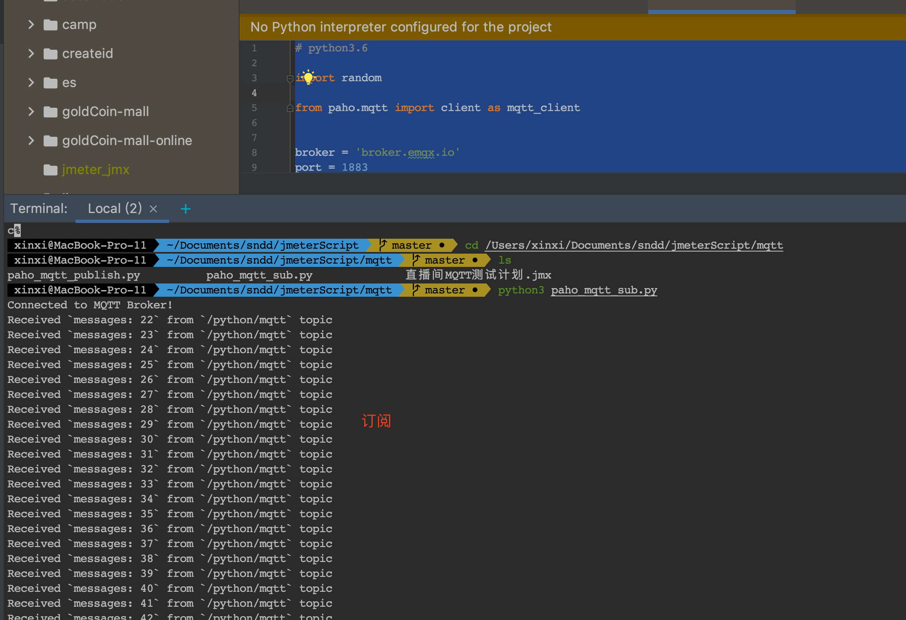

# [转]MQTT压测


# 背景

因为某天晚上的直播课,在开始直播间刚进入教室的时候,某些Android低端机会ANR.

经过排查是客户端收到了大量的进入教室和退出教室信令,客户端解析大量信令,会导致客户端cpu飙升.

因为直播信令是基于MQTT协议,每个学生端都会订阅同样的topic,所以学生端也会收到其他学生端的进入教室和退出教室信令.

我们基于上面的问题,需要对客户端进行压测,看一个客户端需要收到多少QPS的情况下不会ANR.

我们日常工作中很少会压测MQTT,基本上都是HTTP协议,本次也是记录一些学习过程.

# 什么是信令?

直播是一套负责的业务体系,信令更新是底层的交互方式,所以先要了解什么是信令.

可以参考: https://zhuanlan.zhihu.com/p/72028159

直播信令: 简单来说就是老师端发给学生端(客户端)的一些信号指令,比如:连麦、视频、发题、留言等.

这些信令是双向的、也有可能是一对多.我们用的MQTT协议,MQTT提供商有很多,比如融云、阿里云等

# MQTT协议

## 概念

MQTT协议是基于发布/订阅模式的物联网通信协议，凭借简单易实现、支持 QoS、报文小等特点，占据了物联网协议的半壁江山

MQTT协议广泛应用于物联网、移动互联网、智能硬件、车联网、电力、能源等领域

## 名词

### 发布

### 订阅

### 主题

### 会话保持

### QoS:

QoS 0 是一种 "fire and forget" 的消息发送模式：Sender (可能是 Publisher 或者 Broker) 发送一条消息之后，就不再关心它有没有发送到对方，也不设置任何重发机制。

QoS 1 包含了简单的重发机制，Sender 发送消息之后等待接收者的 ACK，如果没收到 ACK 则重新发送消息。这种模式能保证消息至少能到达一次，但无法保证消息重复。

QoS 2 设计了略微复杂的重发和重复消息发现机制，保证消息到达对方并且严格只到达一次

# 搭建MQTT服务

## 本地搭建

在Mac机器上

```text
docker run -d --name emqx -p 1883:1883 -p 8083:8083 -p 8883:8883 -p 8084:8084 -p 18083:18083 emqx/emqx
```


```text
mqtt: http://127.0.0.1:18083
admin/public
```

发布消息

```text
brew install mosquitto
mosquitto_sub -h 127.0.0.1 -p 1883 -t topic -q 2
mosquitto_pub -h 127.0.0.1 -p 1883 -t topic -q 1 -m "Hello, MQTT!"
```


## 使用免费的

使用 EMQ X 提供的 免费公共 MQTT 服务器，该服务基于 EMQ X 的 MQTT 物联网云平台 创建。服务器接入信息如

```text
Broker: broker.emqx.io

TCP Port: 1883

Websocket Port: 8083
```

# python连接MQTT

## paho-mqtt

paho-mqtt 是目前 Python 中使用较多的 MQTT 客户端库，它在 Python 2.7 或 3.x 上为客户端类提供了对 MQTT v3.1 和 v3.1.1 的支持。它还提供了一些帮助程序功能，使将消息发布到 MQTT 服务器变得非常简单。

```text
pip3 install -i https://pypi.doubanio.com/simple paho-mqtt
```

## 发布

脚本如下

```text
import time
import random
from paho.mqtt import client as mqtt_client

"""
发布者
"""


broker = 'broker.emqx.io'
port = 1883
topic = "/python/mqtt"

client_id = f'python-mqtt-{random.randint(0, 1000)}'


def connect_mqtt():
    def on_connect(client, userdata, flags, rc):
        if rc == 0:
            print("Connected to MQTT Broker!")
        else:
            print("Failed to connect, return code %d\n", rc)
    # Set Connecting Client ID
    client = mqtt_client.Client(client_id)
    client.on_connect = on_connect
    client.connect(broker, port)
    return client


def publish(client):
    msg_count = 0
    while True:
        time.sleep(1)
        msg = f"messages: {msg_count}"
        result = client.publish(topic, msg)
        # result: [0, 1]
        status = result[0]
        if status == 0:
            print(f"Send `{msg}` to topic `{topic}`")
        else:
            print(f"Failed to send message to topic {topic}")
        msg_count += 1


def run():
    client = connect_mqtt()
    client.loop_start()
    publish(client)


if __name__ == '__main__':
    run()
```


## 订阅

```text
# python3.6

import random

from paho.mqtt import client as mqtt_client


broker = 'broker.emqx.io'
port = 1883
topic = "/python/mqtt"
# generate client ID with pub prefix randomly
client_id = f'python-mqtt-{random.randint(0, 100)}'


def connect_mqtt() -> mqtt_client:
    def on_connect(client, userdata, flags, rc):
        if rc == 0:
            print("Connected to MQTT Broker!")
        else:
            print("Failed to connect, return code %d\n", rc)

    client = mqtt_client.Client(client_id)
    client.on_connect = on_connect
    client.connect(broker, port)
    return client


def subscribe(client: mqtt_client):
    def on_message(client, userdata, msg):
        print(f"Received `{msg.payload.decode()}` from `{msg.topic}` topic")

    client.subscribe(topic)
    client.on_message = on_message


def run():
    client = connect_mqtt()
    subscribe(client)
    client.loop_forever()


if __name__ == '__main__':
    run()
```




# jmeter压测MQTT

jmeter本身就支持多协议压测,需要安装扩展插件.

插件下载完成后放到lib下.

```text
https://github.com/hgwz/Java-websocket/tree/master/lib/ext/mqtt-xmeter-1.0.1-jar-with- dependencies.jar
```

在取样器能看到MQTT插件说明安装成功.


在connect中输入host、username、password、clientid


在pub中输入topic、qos、message


message type有三种格式,根据自己需要选择.


不能使用一个clientid,会出现连不上mqtt.


尽量模拟多个客户端,使用jmeter的随机函数.


此时连接和发送成功.


# locust压测MQTT

locust是python的一个基于协程的类库,locust也是可以进行MQTT协议压测

可以参考这个帖子,写的很详细.

```text
https://blog.csdn.net/qq_39214101/article/details/107997414
```

脚本如下:

```text
#!/user/bin/env python
# -*- coding: utf-8 -*-

import os
import time
from locust import User, task, between, events
from paho.mqtt.client import Client

broker = 'broker.emqx.io'

topic = "/python/mqtt"

class MQTTPubClient(Client):

    # 要集成paho的Client,最底层用的也是paho

    def on_connect_rewrite(self, client, userdata, flags, rc):
        print("Connected with result code: " + str(rc))

    def on_message_rewrite(self, client, userdata, msg):
        print(msg.topic + " " + str(msg.payload))

    Client.on_connect = on_connect_rewrite
    Client.on_message = on_message_rewrite

    def __getattribute__(self, name):
        func = Client.__getattribute__(self, name)
        print("func:{}".format(func))

        def wrapper(*args, **kwargs):
            start_time = time.time()
            try:
                result = func(*args, **kwargs)
                print('*' * 100, '\n', result, '$' * 100)
            except Exception as e:
                total_time = int((time.time() - start_time) * 1000)
                events.request_failure.fire(request_type="mqtt_pub", name=name,
                                            response_time=total_time, exception=e,
                                            response_length=0)
            else:
                total_time = int((time.time() - start_time) * 1000)
                events.request_success.fire(request_type="mqtt_pub", name=name,
                                            response_time=total_time, response_length=0)

        return wrapper


class MQTTUser(User):
    abstract = True

    def __init__(self, *args, **kwargs):
        super(MQTTUser, self).__init__(*args, **kwargs)
        self.client = MQTTPubClient()


class PubUser(MQTTUser):
    wait_time = between(3, 5)

    def on_start(self):
        self.client.connect(self.host, 1883, 1000)

    @task
    def test_mqtt_pub(self):
        print("start to send mqtt message")
        print(self.client)
        self.client.publish(topic, payload='testggg', qos=0)


class SubUser(MQTTUser):
    wait_time = between(3, 5)

    def on_start(self):
        self.client.connect(broker, 1883, 600)

    @task
    def test_mqtt_sub(self):
        print("recive message sussecc!!!")
        self.client.subscribe(topic, qos=0)


if __name__ == '__main__':
    os.system("locust -f locust_mqtt_demo1.py -u 1 -r 1 --headless  --host=127.0.0.1")
```

发布者

```text
locust -f locust_mqtt.py PubUser -u 1 -r 1 --host=127.0.0.1
```


订阅者

```text
locust -f locust_mqtt.py PubUser -u 1 -r 1 --host=127.0.0.1
```


在locust使用paho,由于是继承了client类, 在使用是有些方法可以根据业务需求来重写


# 客户端性能分析

由于文章最开始提到客户端在直播间收到大量信令会ANR,我们需要看关注下设备的CPU.

这里使用的工具是perfdog: https://perfdog.qq.com/,这个工具安装使用很简单, 这里就讲解了.

下面这张图是,模拟压测产生ANR的客户端性能消耗.


