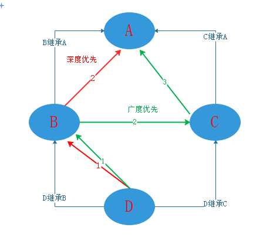

# Python多继承方式及顺序


先了解两个概念：深度优先、广度优先。

#### 深度优先 or 广度优先

深度优先和广度优先是两种不同的算法策略，两者有什么区别呢？



如图，B 继承 A， C 继承 A， D 继承 B 和 C。

深度优先遍历是从 D 开始往上搜索到 B，若 B 没有数据，则继续往上搜索到 A；

广度优先遍历是从 D 开始往上搜索到 B，若 B 没有数据，则搜索和 B 同级的 C 里的数据，若同级的 C 里还是没有数据，再继续往上搜索到 A 。


Tips：py2 经典类是按深度优先来继承的，新式类是按广度优先来继承的。
           py3 经典类和新式类都是统一按广度优先来继承的。


####  Python3 里的多继承顺序


 先定义几个类，B 继承 A， C 继承 A， D 继承 B 和 C

```python
class A():
    def __init__(self):
        print("A")

class B(A):
    def __init__(self):
         print("B")

class C(A):
    def __init__(self):
        print("C")

class D(B,C):
    def __init__(self):
        print("D")
```


当 D 里面没有参数时，到父类里找。我们知道，D 的父类是 B 和 C，且定义的顺序是 B在左，C在右。验证以下代码后，可以看到，继承顺序是从左到右的

```python
class A():
    def __init__(self):
        print("A")

class B(A):
    def __init__(self):
        print("B")

class C(A):
    def __init__(self):
        print("C")

class D(B,C):
    pass
    # def __init__(self):
    #     print("D")

D()   # D里面没有，则找父类（从左往右），找到B
# B
```


当 B 里面也没有参数时，D 就找父类 C

```python
class A():
    def __init__(self):
        print("A")

class B(A):
    pass
    # def __init__(self):
    #     print("B")

class C(A):
    def __init__(self):
        print("C")

class D(B,C):
    pass
    # def __init__(self):
    #     print("D")

D()   
# C
```


那么，当 B 和 C里都没有参数时，D该找谁呢？------答案是： A

```python
class A():
    def __init__(self):
        print("A")

class B(A):
    pass
    # def __init__(self):
    #     print("B")

class C(A):
    pass
    # def __init__(self):
    #     print("C")

class D(B,C):
    pass
    # def __init__(self):
    #     print("D")

D()
# A
```

