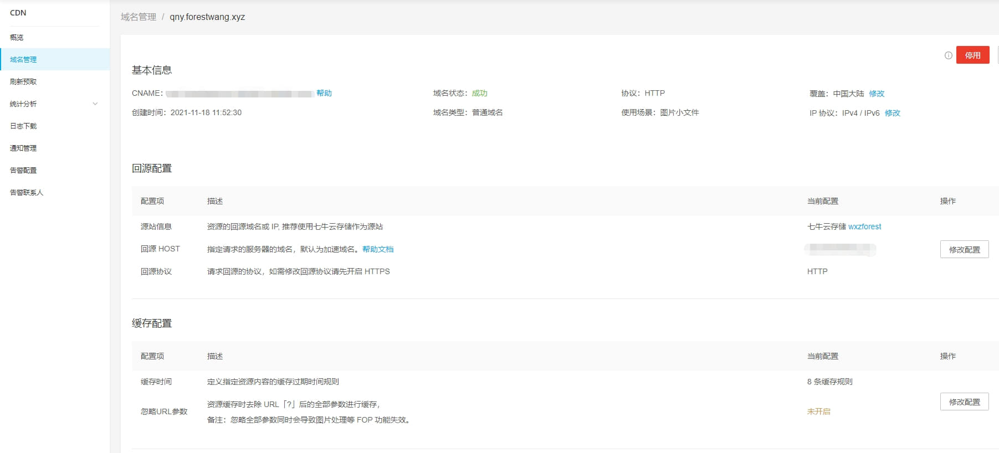
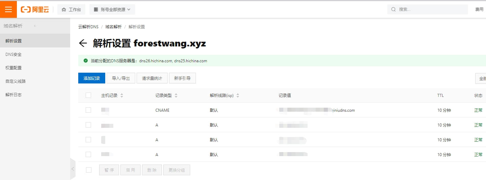
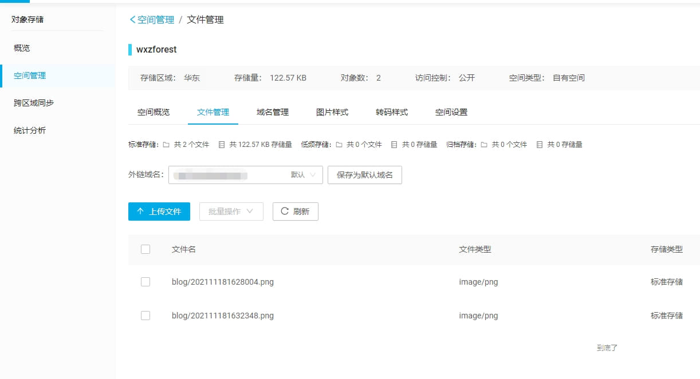
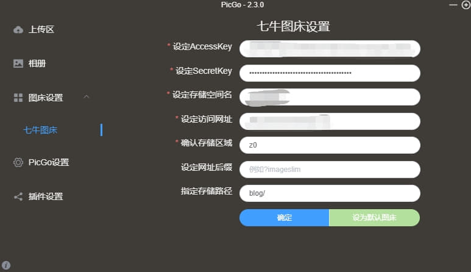
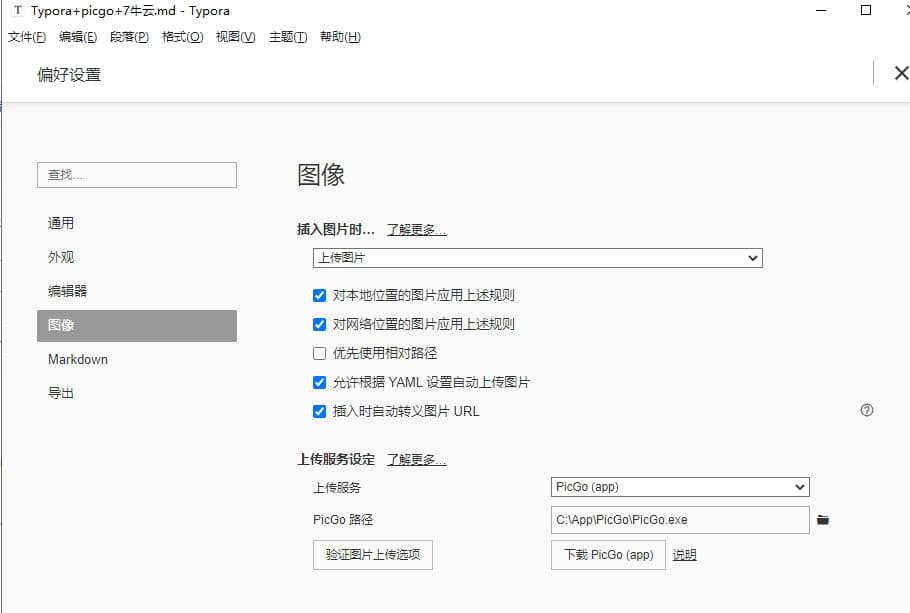

# Typora+picgo+7牛云

## Typora+picgo+七牛云

1. 注册七牛云

2. 实名认证，赠送10G免费存储空间，默认送一个CDN域名但是只有3个月使用期限，所以需要自己购买域名。

3. 新增CDN域名（必须要备案过的域名），系统会生成一个CNAME

   

4. 将CDN域名解析至CNAME域名即可绑定成功

   

5. 新增空间并配置CDN域名，配置默认外域链接名为配置好的CDN域名，上传一张图片，图片详情里面的文件连接方式即可变更为你的CDN域名。

   

6. 下载安装[picgo](https://molunerfinn.com/PicGo/)，选择七牛图床，AccessKey/SecretKey在七牛云个人设置-密钥管理中配置，配置好后上传图片即可成功

   

7. 在typora-偏好设置-图像 里，设置上传服务设定，复制粘贴图片即可自动上传到七牛云上

   

## PICGO插件

插件库：[Awesome-picgo](https://github.com/PicGo/Awesome-PicGo)

图片压缩插件：[compress](https://github.com/JuZiSang/picgo-plugin-compress)

自定义图片路径插件：[rename-file](https://github.com/liuwave/picgo-plugin-rename-file)

## 图片保存本地

图片压缩工具：Caesium Image Compressor

## Typora

[文档](https://www.typora.net/support/)

