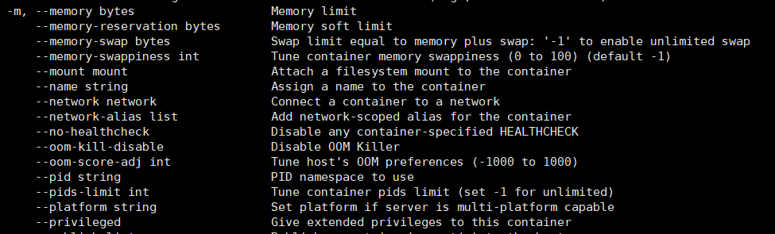

# Docker限制容器占用的内存大小

小服务器，内存只有2G不够用，得精打细算限制下容器占用的内存，有几种方式可考虑。

## 一、直接限制docker容器的内存

容器使用的内存包括物理内存和 swap。Docker 通过下面两组参数来限制容器内存的大小：

- -m：限制内存的大小。如：-m 100M，表示容器最多使用100M内存。-m 1G，最多使用1G内存。

- –-memory-swap：设置swap 的使用限额。

执行docker run --help命令可看到以上命令相关介绍### 1.1 

> https://blog.csdn.net/qq_37611270/article/details/97243704
>
> https://www.lixianyang.xyz/posts/docker-%E5%86%85%E5%AD%98-limit-%E4%B8%8E-swap-%E9%99%90%E5%88%B6/
