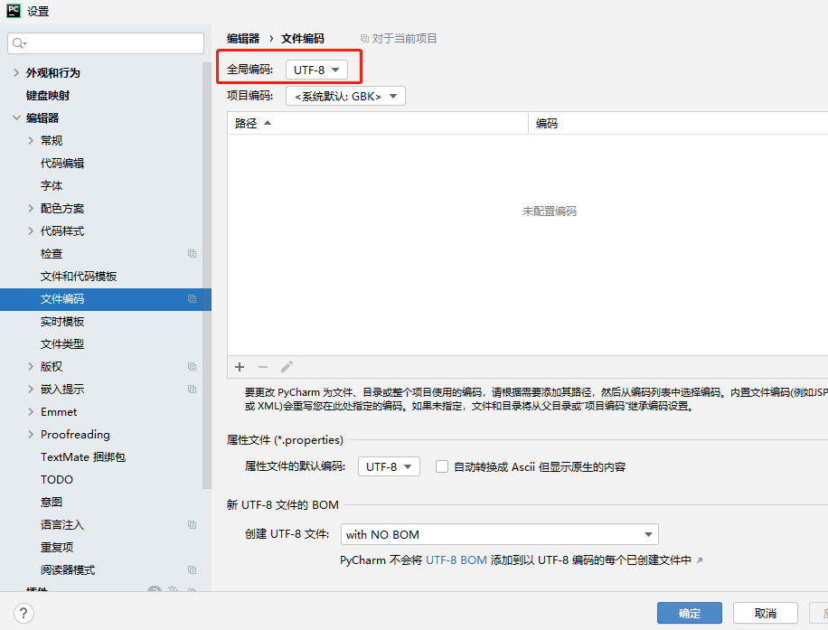

# Pycharm生成allure report失败


代码：

```
os.system(
        f'allure generate {file_path["report"]}/data -o {file_path["report"]}/html --clean')
```

控制台返回乱码，期望路径下未生成报告。

原因：pycharm的Global Encoding设置的utf-8，与操作系统不一致，改为GBK后ok了。


