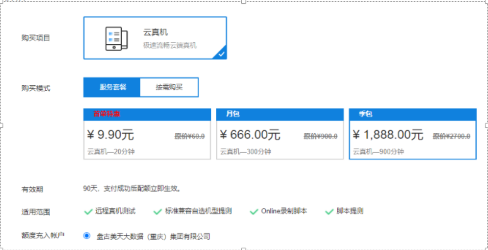

# 云测平台兼容性测试方案选型

关于兼容性测试解决方案，经过调研云测平台能够给我们提供以下3种解决方案。我本人比较推荐1和2共同使用，建议先购买云测月包套餐666元，初期主要用于编写兼容性测试脚本，待脚本稳定后可选择购买季包套餐（单次兼容性测试价格大概409元）或者按需购买套餐（单次兼容性测试价格大概526.5元）。

以下是简单说明，详细报告请查阅附件。

#### 1、标准兼容测试免费版：

优势：

免费、自动化测试、自动出测试报告、安卓/IOS系统版本可以完全覆盖、不同设备分辨率可以完全覆盖。

劣势：

1、每天限使用1次；

2、只能做安装、启动、卸载、monkey随机测试，不能实现业务场景；

3、部分市面常见机型覆盖不到。

价格：

免费，每天限使用1次。

#### 2、远程真机付费自动化测试：

优势：

1、业务场景可以全覆盖，市面常见机型覆盖基本可以覆盖，安卓/IOS系统版本可以完全覆盖，不同设备分辨率可以完全覆盖；

2、购买分钟数后随时可用，远程连接云端真机测试；

3、人工手动测试，可操作性强，可随时复现问题；

劣势：

1、需要设计开发自动化测试脚本、或者人工手动测试完成，会增加测试时间，覆盖机型越多增加的时间成本和经济成本越高；

2、不能自动出测试报告，需要将自动化测试报告整合为兼容性测试报告；

3、需要进行人员培训，需要学习使用云测平台云端录入脚本、常见adb命令等；

价格：

市面常用手机列举了13款，假定一次兼容性测试预计在15分钟内完成：

如购买季包1888元，单次兼容性测试价格大概：(1888/900)*(13*15)=409元

如按需购买，单机3元/分钟打9折，单次兼容性测试价格大概：13*15*3*0.9=526.5元

#### 3、深度兼容测试：

最低5000元套餐：

1、单次测试最低收费5000，包含100款机型兼容性测试。【可以覆盖完全上面列举所有机型、系统版本、设备分辨率】

2、由testin业务方编写自动化脚本，脚本运行时间在10分钟内。【满足UI展示相关的大部分业务需求，但涉及到停车缴费业务因为需要和设备或POS互动完成出入场缴费、测试数据准备工作，还需要我方配合设计开发脚本，我方工作量也不会小】

其他定制套餐，根据需求方个性化定制，单次测试价格从5000至50000不等。
