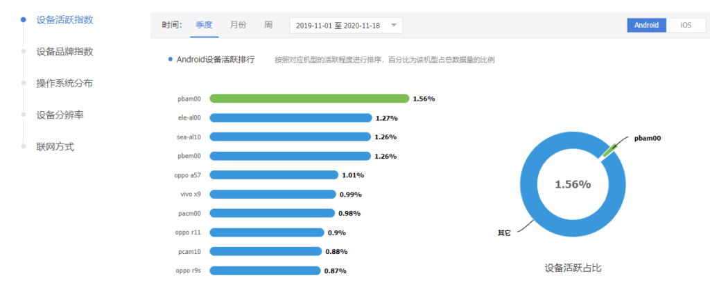
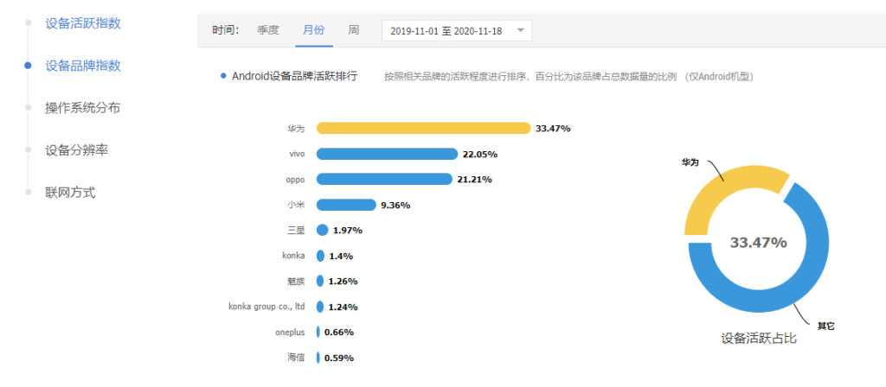
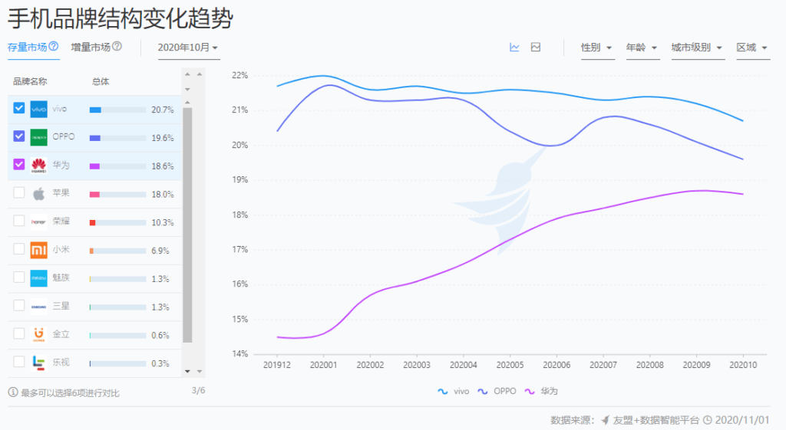
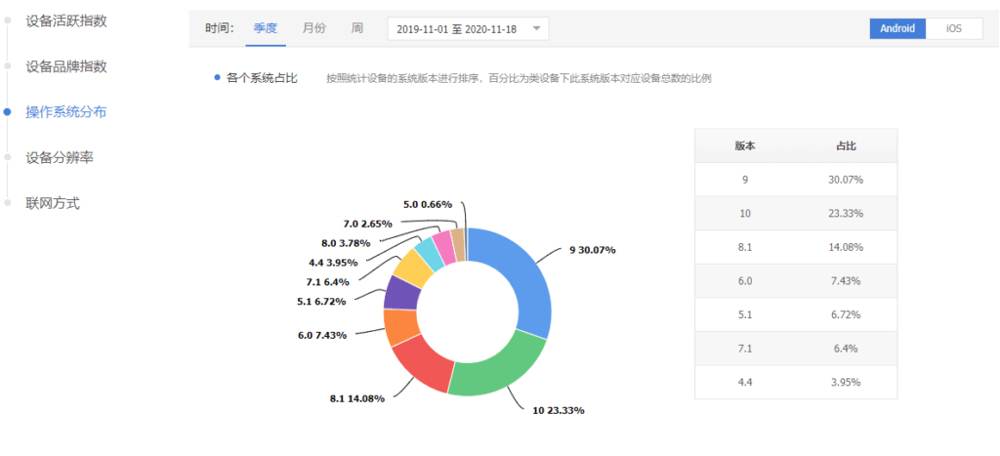
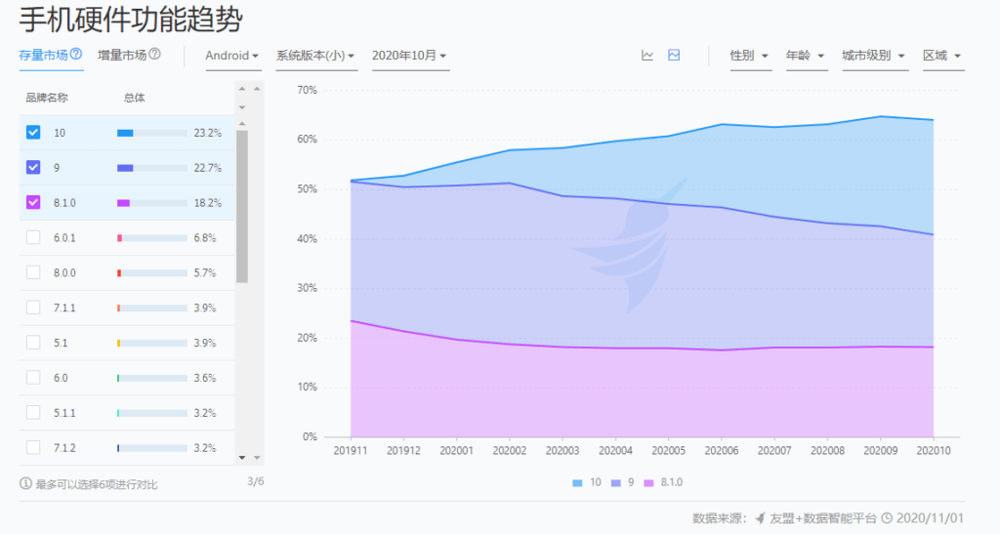
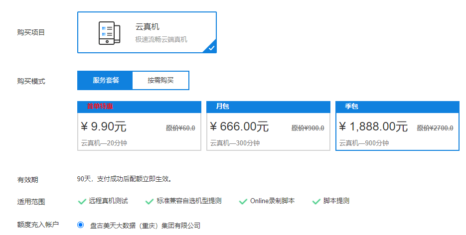

# 云测平台兼容性测试方案选型（附件）

## 一般可能导致APP存在兼容性问题的几个原因分析：

1、不同厂家的UI操作系统存在差异化，可能导致APP功能实现存在兼容性问题。

2、不同硬件操作系统版本兼容性不一致，可能导致APP功能实现存在兼容性问题。

3、不同分辨率的设备，独特设计的如刘海屏、挖空屏可能导致APP的UI展示存在兼容性问题。

## 市场调研结果梳理：

### 1、市面常见手机型号？

经查阅相关资料及报告：

> *（腾讯移动分析报告**2019**年**11**月**-2020**年**11**月设备活跃指数与设备品牌指数数据)*

> *（友盟指数报告**2019**年**11**月**-2020**年**11**月手机品牌结构变化数据)*

*市面常见手机型号结论：*

根据以上报告分析得出，表格内品牌及型号手机是当前市面上使用率较高手机，兼容性测试需要尽可能覆盖到以下型号：

| 品牌   | 型号                    |
| ------ | ----------------------- |
| OPPO   | oppo A5全网通版(pbam00) |
| 华为   | HUAWEI P30(ELE-AL00)    |
| 华为   | 华为nova5 Pro(SEA-AL10) |
| OPPO   | OPPO R17(PBEM00)        |
| OPPO   | OPPO A57                |
| VIVO   | VIVO X9                 |
| OPPO   | OPPO R15(PACM00)        |
| 荣耀   | 荣耀9X(HLK-AL00)        |
| VIVO   | vivo Y3 (V1901A)        |
| OPPO   | OPPO A9(PCAM10)         |
| 小米   | 小米 6                  |
| 小米   | Redmi 9                 |
| IPHONE | IPHONE 10               |
| IPHONE | IPHONE 7PLUS            |
| IPHONE | IPHONE 6S-PLUS          |
| IPHONE | IPHONE 7                |

### 2.市面常见安卓版本？

经查阅相关资料及报告

> *（腾讯移动分析报告**2019**年**11**月**-2020**年**11**月操作系统分布数据)*

> *（友盟指数报告**2019**年**11**月**-2020**年**11**月硬件功能趋势数据)*

*市面常见安卓版本结论：*

兼容性测试需要覆盖到常见的以下版本：

安卓：10、9、8.1、7.1

IPHONE：13.6、13.7、14.1、13.3

## 云测testin平台能够提供的兼容性解决方案

标准兼容测试免费版：

优势：

免费、自动化测试、自动出测试报告、安卓/IOS系统版本可以完全覆盖、不同设备分辨率可以完全覆盖。

劣势：

1、每天限使用1次；

2、只能做安装、启动、卸载、monkey随机测试，不能实现业务场景；

3、部分市面常见机型覆盖不到。

价格：

免费，每天限使用1次。

远程真机付费自动化测试：

优势：

1、业务场景可以全覆盖，市面常见机型覆盖基本可以覆盖，安卓/IOS系统版本可以完全覆盖，不同设备分辨率可以完全覆盖；

2、购买分钟数后随时可用，远程连接云端真机测试；

3、人工手动测试，可操作性强，可随时复现问题；

劣势：

1、需要设计开发自动化测试脚本、或者人工手动测试完成，会增加测试时间，覆盖机型越多增加的时间成本和经济成本越高；

2、不能自动出测试报告，需要将自动化测试报告整合为兼容性测试报告；

3、需要进行人员培训，需要学习使用云测平台云端录入脚本、常见adb命令等；

价格：

市面常用手机列举了13款，假定一次兼容性测试预计在15分钟内完成：

如购买季包1888元，单次兼容性测试价格大概：(1888/900)*(13*15)=409元

如按需购买，单机3元/分钟打9折，单次兼容性测试价格大概：13*15*3*0.9=526.5元

深度兼容测试：

最低5000元套餐：

1、单次测试最低收费5000，包含100款机型兼容性测试。【可以覆盖完全上面列举所有机型、系统版本、设备分辨率】

2、由testin业务方编写自动化脚本，脚本运行时间在10分钟内。【满足UI展示相关的大部分业务需求，但涉及到停车缴费业务因为需要和设备或POS互动完成出入场缴费、测试数据准备工作，还需要我方配合设计开发脚本，我方工作量也不会小】

其他定制套餐，根据需求方个性化定制，单次测试价格从5000至50000不等。

## 参考资料：

腾讯移动分析：https://mta.qq.com/mta/data/device/os

友盟指数：https://compass.umeng.com/?utm_source=zzbanner

云测官网：http://tpayapi.testin.cn/
