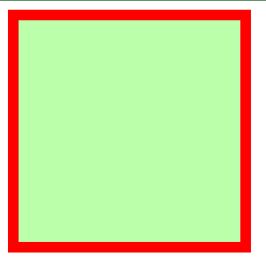
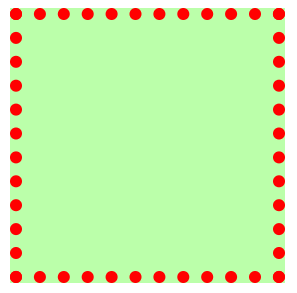
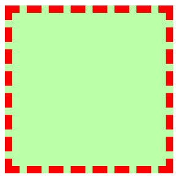

# 【前端学习笔记】CSS3


# CSS
CSS控制页面的表现。

层叠样式表。网页实际上是多层结构，通过CSS可以分别为网页的每层设置样式，最终我们只看到最上面一层。

## 使用方式

> 第一种 **内联样式、行内样式**：
>
> 在标签内部通过style属性来设置。
>
> ```html
> <p style="color: red; font-size: 30px;">红色</p>
> ```
>
> 第二种 **内部样式表**：
>
> 在head元素的style标签中编写
>
> ```html
> <head>
> <style>
> p{
> 	color: green;
> 	font-size: 60px;
> }
> </style>
> </head>
> ```
>
> 第三种 **外部样式表**：
>
> 将css样式编写到一个外部css文件中，然后通过link标签来引入外部css文件
>
> ```html
> <link rel="stylesheet" href="./style.css">
> ```
>

## CSS语法

> 注释：
>
>
> ```html
> /* CSS的注释 */
> 快捷键：ctrl + /
> ```
>
## [选择器、声明块（w3school）](https://www.w3school.com.cn/cssref/css_selectors.asp)：
>元素选择器：
>
>* 通过选择器可以选中页面中指定元素
>* 通过声明块来指定选择元素的样式
>
>```html
><style>
>/* 
>用法：选择器{ 声明块 }
>例子：p{} h1{} div{} 
>*/
>
>/* p元素样式 */
>p{color: red; font-size: 30px;}
>
>/* h1元素样式 */
>h1{color: blue;}
></style>
>```
>
>分组选择器：
>
>* 符合多个条件并集的选择器
>* 语法：选择器1,选择器2,选择器n{}
>
>```html
>/* p元素或者h1元素字体颜色为绿色 */
>p,h1{color: green;}
>
>/* p元素或者h1元素字体颜色为绿色 */
>p.class1,h1.class2{color: green;}
>```
>
>id选择器：
>
>* 根据元素的id属性值选中一个元素，id不能重复
>* 在一个 HTML 文档中，ID 选择器会使用一次，而且仅一次
>* ID 选择器不能结合使用，因为 ID 属性不允许有以空格分隔的词列表。
>*  ID 选择器可能是区分大小写的。这取决于文档的语言。
>
>
>```html
>#id{color: red;}
>```
>
>class 类选择器：
>
>* 根据元素的class属性值选中一个元素，class可重复
>
>* 一个元素可以指定多个class
>
>
>```html
>.class{color: red;}
>p.class{color: red;}
>p.class1.class2{color: red;}
>```
>
>通配选择器：
>
>* 选中页面所有元素
>
>
>```html
>*{color: red;}
>```
>
>复合选择器：
>
>* 选中同时符合多个条件的元素
>* 语法：选择器1选择器2选择器n{}
>
>```html
>/* div元素class=class1的字体颜色为红色 */
>div.class1{color: red;}
>
>/* p元素class=class1 class2的字体颜色为蓝色 */
>p.class1.class2{color: blue;}
>```
>
>关系选择器：
>
>* 父元素
>
>* 子元素：选择子元素
>
>```html
>语法：父元素 > 子元素 > 子元素n {}
>
>/* p中的span元素颜色为红色 */
>p > span{color: red;}
>
>/* div中的p元素（包括p中的其他元素）颜色为橙色 */
>div > p{color: orange;}
>
>/* div中的p元素中的span元素颜色为橙色 */
>div > p > span{color: orange;}
>```
>
>* 祖先元素
>
>* 后代元素：选择后代元素
>
>```html
>语法：祖先元素 后代元素 {}
>
>/* div中及后代的span元素颜色为橙色 */
>div span{color: orange;}
>```
>
>* 兄弟元素：
>
>```html
>选择下一个兄弟元素
>语法：兄弟元素1 + 兄弟元素2 {}
>
>选择下边所有元素
>语法：兄弟元素1 ~ 兄弟元素2 {}
>```
>
>属性选择器：
>
>* [属性名] 选择有指定属性名的元素
>
>* [属性名=属性值] 选择有指定属性名和属性值的元素
>
>* [属性名~=属性值] 根据部分属性值选择
>
>* [属性名^=属性值] 选择属性值以指定值开头的元素
>
>* [属性名$=属性值] 选择属性值以指定值结尾的元素
>
>* [属性名*=属性值] 选择属性值包含指定值的元素
>
>```html
>p[title]{color: orange;}
>div[class=class1]{color: orange;}
>div[class=class1][title]{color: orange;}
>```
>
>伪类选择器：
>
>* 用来描述一个元素的特殊状态，如第一个子元素、被点击的元素、鼠标移入的元素
>* 一般情况下使用 : 开头
>
>```html
>/* 如果li是ul的第一个子元素则字体红色 */
>ul > li:first-child{ color: red; }
>/* 如果li是ul的最后一个子元素则字体红色 */
>ul > li:last-child{ color: red; }
>/* 如果li是ul的第n个子元素 */
>ul > li:nth-child(){ color: red; }
>
>/* 每种类型的第一个元素颜色为红色 */
>ul > :first-of-type{color: red;}
>/* 除了每种类型的第一个元素，其他元素颜色为红色
>ul > not(:first-of-type){color: red;}
>```
>


### 选择器例子

| 选择器                                                       | 例子                                           | 例子描述                                             |
| :----------------------------------------------------------- | :--------------------------------------------- | :--------------------------------------------------- |
| [.*class*](https://www.w3school.com.cn/cssref/selector_class.asp) | .intro                                         | 选择 class="intro" 的所有元素。                      |
| .*class1*.*class2*                                           | .name1.name2                                   | 选择 class 属性中同时有 name1 和 name2 的所有元素。  |
| .*class1* .*class2*                                          | .name1 .name2                                  | 选择作为类名 name1 元素后代的所有类名 name2 元素。   |
| [#*id*](https://www.w3school.com.cn/cssref/selector_id.asp)  | #firstname                                     | 选择 id="firstname" 的元素。                         |
| [*](https://www.w3school.com.cn/cssref/selector_all.asp)     | *                                              | 选择所有元素。                                       |
| [*element*](https://www.w3school.com.cn/cssref/selector_element.asp) | p                                              | 选择所有 <p> 元素。                                  |
| [*element*.*class*](https://www.w3school.com.cn/cssref/selector_element_class.asp) | p.intro                                        | 选择 class="intro" 的所有 <p> 元素。                 |
| [*element*,*element*](https://www.w3school.com.cn/cssref/selector_element_comma.asp) | div, p                                         | 选择所有 <div> 元素和所有 <p> 元素。                 |
| [*element* *element*](https://www.w3school.com.cn/cssref/selector_element_element.asp) | div p                                          | 选择 <div> 元素内的所有 <p> 元素。                   |
| [*element*>*element*](https://www.w3school.com.cn/cssref/selector_element_gt.asp) | div > p                                        | 选择父元素是 <div> 的所有 <p> 元素。                 |
| [*element*+*element*](https://www.w3school.com.cn/cssref/selector_element_plus.asp) | div + p                                        | 选择紧跟 <div> 元素的首个 <p> 元素。                 |
| [*element1*~*element2*](https://www.w3school.com.cn/cssref/selector_gen_sibling.asp) | p ~ ul                                         | 选择前面有 <p> 元素的每个 <ul> 元素。                |
| [[*attribute*\]](https://www.w3school.com.cn/cssref/selector_attribute.asp) | [target]                                       | 选择带有 target 属性的所有元素。                     |
| [[*attribute*=*value*\]](https://www.w3school.com.cn/cssref/selector_attribute_value.asp) | [target=_blank]                                | 选择带有 target="_blank" 属性的所有元素。            |
| [[*attribute*~=*value*\]](https://www.w3school.com.cn/cssref/selector_attribute_value_contain.asp) | [title~=flower]                                | 选择 title 属性包含单词 "flower" 的所有元素。        |
| [[*attribute*\|=*value*\]](https://www.w3school.com.cn/cssref/selector_attribute_value_start.asp) | [lang\|=en]                                    | 选择 lang 属性值以 "en" 开头的所有元素。             |
| [[*attribute*^=*value*\]](https://www.w3school.com.cn/cssref/selector_attr_begin.asp) | a[href^="https"]                               | 选择其 src 属性值以 "https" 开头的每个 <a> 元素。    |
| [[*attribute*$=*value*\]](https://www.w3school.com.cn/cssref/selector_attr_end.asp) | a[href$=".pdf"] | 选择其 src 属性以 ".pdf" 结尾的所有 <a> 元素。 |                                                      |
| [[*attribute**=*value*\]](https://www.w3school.com.cn/cssref/selector_attr_contain.asp) | a[href*="w3schools"]                           | 选择其 href 属性值中包含 "abc" 子串的每个 <a> 元素。 |
| [:active](https://www.w3school.com.cn/cssref/selector_active.asp) | a:active                                       | 选择活动链接。                                       |
| [::after](https://www.w3school.com.cn/cssref/selector_after.asp) | p::after                                       | 在每个 <p> 的内容之后插入内容。                      |
| [::before](https://www.w3school.com.cn/cssref/selector_before.asp) | p::before                                      | 在每个 <p> 的内容之前插入内容。                      |
| [:checked](https://www.w3school.com.cn/cssref/selector_checked.asp) | input:checked                                  | 选择每个被选中的 <input> 元素。                      |
| [:default](https://www.w3school.com.cn/cssref/selector_default.asp) | input:default                                  | 选择默认的 <input> 元素。                            |
| [:disabled](https://www.w3school.com.cn/cssref/selector_disabled.asp) | input:disabled                                 | 选择每个被禁用的 <input> 元素。                      |
| [:empty](https://www.w3school.com.cn/cssref/selector_empty.asp) | p:empty                                        | 选择没有子元素的每个 <p> 元素（包括文本节点）。      |
| [:enabled](https://www.w3school.com.cn/cssref/selector_enabled.asp) | input:enabled                                  | 选择每个启用的 <input> 元素。                        |
| [:first-child](https://www.w3school.com.cn/cssref/selector_first-child.asp) | p:first-child                                  | 选择属于父元素的第一个子元素的每个 <p> 元素。        |
| [::first-letter](https://www.w3school.com.cn/cssref/selector_first-letter.asp) | p::first-letter                                | 选择每个 <p> 元素的首字母。                          |
| [::first-line](https://www.w3school.com.cn/cssref/selector_first-line.asp) | p::first-line                                  | 选择每个 <p> 元素的首行。                            |
| [:first-of-type](https://www.w3school.com.cn/cssref/selector_first-of-type.asp) | p:first-of-type                                | 选择属于其父元素的首个 <p> 元素的每个 <p> 元素。     |
| [:focus](https://www.w3school.com.cn/cssref/selector_focus.asp) | input:focus                                    | 选择获得焦点的 input 元素。                          |
| [:fullscreen](https://www.w3school.com.cn/cssref/selector_fullscreen.asp) | :fullscreen                                    | 选择处于全屏模式的元素。                             |
| [:hover](https://www.w3school.com.cn/cssref/selector_hover.asp) | a:hover                                        | 选择鼠标指针位于其上的链接。                         |
| [:in-range](https://www.w3school.com.cn/cssref/selector_in-range.asp) | input:in-range                                 | 选择其值在指定范围内的 input 元素。                  |
| [:indeterminate](https://www.w3school.com.cn/cssref/selector_indeterminate.asp) | input:indeterminate                            | 选择处于不确定状态的 input 元素。                    |
| [:invalid](https://www.w3school.com.cn/cssref/selector_invalid.asp) | input:invalid                                  | 选择具有无效值的所有 input 元素。                    |
| [:lang(*language*)](https://www.w3school.com.cn/cssref/selector_lang.asp) | p:lang(it)                                     | 选择 lang 属性等于 "it"（意大利）的每个 <p> 元素。   |
| [:last-child](https://www.w3school.com.cn/cssref/selector_last-child.asp) | p:last-child                                   | 选择属于其父元素最后一个子元素每个 <p> 元素。        |
| [:last-of-type](https://www.w3school.com.cn/cssref/selector_last-of-type.asp) | p:last-of-type                                 | 选择属于其父元素的最后 <p> 元素的每个 <p> 元素。     |
| [:link](https://www.w3school.com.cn/cssref/selector_link.asp) | a:link                                         | 选择所有未访问过的链接。                             |
| [:not(*selector*)](https://www.w3school.com.cn/cssref/selector_not.asp) | :not(p)                                        | 选择非 <p> 元素的每个元素。                          |
| [:nth-child(*n*)](https://www.w3school.com.cn/cssref/selector_nth-child.asp) | p:nth-child(2)                                 | 选择属于其父元素的第二个子元素的每个 <p> 元素。      |
| [:nth-last-child(*n*)](https://www.w3school.com.cn/cssref/selector_nth-last-child.asp) | p:nth-last-child(2)                            | 同上，从最后一个子元素开始计数。                     |
| [:nth-of-type(*n*)](https://www.w3school.com.cn/cssref/selector_nth-of-type.asp) | p:nth-of-type(2)                               | 选择属于其父元素第二个 <p> 元素的每个 <p> 元素。     |
| [:nth-last-of-type(*n*)](https://www.w3school.com.cn/cssref/selector_nth-last-of-type.asp) | p:nth-last-of-type(2)                          | 同上，但是从最后一个子元素开始计数。                 |
| [:only-of-type](https://www.w3school.com.cn/cssref/selector_only-of-type.asp) | p:only-of-type                                 | 选择属于其父元素唯一的 <p> 元素的每个 <p> 元素。     |
| [:only-child](https://www.w3school.com.cn/cssref/selector_only-child.asp) | p:only-child                                   | 选择属于其父元素的唯一子元素的每个 <p> 元素。        |
| [:optional](https://www.w3school.com.cn/cssref/selector_optional.asp) | input:optional                                 | 选择不带 "required" 属性的 input 元素。              |
| [:out-of-range](https://www.w3school.com.cn/cssref/selector_out-of-range.asp) | input:out-of-range                             | 选择值超出指定范围的 input 元素。                    |
| [::placeholder](https://www.w3school.com.cn/cssref/selector_placeholder.asp) | input::placeholder                             | 选择已规定 "placeholder" 属性的 input 元素。         |
| [:read-only](https://www.w3school.com.cn/cssref/selector_read-only.asp) | input:read-only                                | 选择已规定 "readonly" 属性的 input 元素。            |
| [:read-write](https://www.w3school.com.cn/cssref/selector_read-write.asp) | input:read-write                               | 选择未规定 "readonly" 属性的 input 元素。            |
| [:required](https://www.w3school.com.cn/cssref/selector_required.asp) | input:required                                 | 选择已规定 "required" 属性的 input 元素。            |
| [:root](https://www.w3school.com.cn/cssref/selector_root.asp) | :root                                          | 选择文档的根元素。                                   |
| [::selection](https://www.w3school.com.cn/cssref/selector_selection.asp) | ::selection                                    | 选择用户已选取的元素部分。                           |
| [:target](https://www.w3school.com.cn/cssref/selector_target.asp) | #news:target                                   | 选择当前活动的 #news 元素。                          |
| [:valid](https://www.w3school.com.cn/cssref/selector_valid.asp) | input:valid                                    | 选择带有有效值的所有 input 元素。                    |
| [:visited](https://www.w3school.com.cn/cssref/selector_visited.asp) | a:visited                                      | 选择所有已访问的链接。                               |

### 样式的继承

* 我们为一个元素设置的样式同时也会应用到它的后代元素上。
* 并不是所有样式都会被继承，比如背景、布局相关不会被继承。

### 选择器的权重

* 样式冲突：当通过不同的元素选中相同的元素，并为其属性设置不同的值，此时发生样式冲突，样式展示由选择器权重决定。
* 权重（优先级）：
  * 内联样式					1,0,0,0
  * id选择器    			     0,1,0,0
  * 类和伪类选择器         0,0,1,0
  * 元素选择器                0,0,0,1
  * 通配选择器                0,0,0,0
  * 继承的样式                无权重
  * !important                获取最高权重
* 比较权重：
  * 需要将所有的选择器的权重相加计算，最后优先级越高则越优先显示（分组选择器是单独计算的）
  * 选择器权重累加不会超过前一档，比如类选择器再怎么加也不会超过id选择器
  * 如果权重计算相等，则代码从上往下使用下面的样式。
  * 若在某个样式后面添加"!important"，则此时样式会获取到最高优先级，超过内联样式。（不要用）

## 番外：像素、百分比、em、rem、RGB、RGBA

像素：显示器由一个个像素构成，不同屏幕像素大小不同。

> 分辨率 = 水平方向像素 * 垂直方向像素

百分比：也可以将属性值设置为相对于其父元素属性的百分比，可以使子元素跟随父元素（暂且先理解成父元素，后面会详细说）的改变而改变。

em：相对于元素的字体大小来计算的，`1em = <self>.font-size * 10`，也就说em值会根据元素本身的字体大小的改变而改变。

rem：相对于根元素的字体大小来计算，`1em = <root>.font-size * 10`，rem值根据html的字体大小改变。

```html
<style>
    * {
        font-size: 24px;
    }
    
    .box1{
        width: 200px; 
        height: 200px;
        background-color: orange;
    }

    .box2{
        width: 50%; 
        height: 50%; 
        background-color: aqua;
    }
    
    .box3{
        font-size: 20px;
        width: 10em;
        height: 10em;
        background-color: greenyellow;
    }
    
    .box4 {
        font-size: 20px;
        width: 10rem; /*当时用rem时，不管怎么改本元素的font-size都是不会变的。需要定义root元素的font-size才可以 */
        height: 10rem;
        background-color: red;
    }
</style>

<div class="box1">
    <div class="box2"></div>
</div>

<div class="box3"></div>

<div class="box4"></div>
```

RGB值：通过三种颜色不同浓度来调配不同的颜色。

> R-red，G-green，B-blue
> 每种颜色范围在“0~255”之间或“0%~100%”。
> 语法：rgb(255,0,0)

RGBA：A表示不透明度

> 1表示完全不透明
> 0表示完全透明
> .5半透明

十六进制RGB值：

> 语法：#红色绿色蓝色
>
> 颜色浓度通过 00-ff 表示
>
> 如果颜色两位两位重复可以进行简写，如`#aabbcc` => `#abc`

## 盒模型

### 文档流 normal flow

* 网页是一个多层的结构，通过CSS可以分别为每一层来设置样式，作为用户来讲只能看到最顶上一层，这些层中***最底下的一层称为文档流***。

* 文档流是网页的基础，我们所创建的元素默认都是在文档流中进行排列。元素主要有两个状态：

  * 在文档流中

  - 不在文档流中（脱离文档流）

* **元素在文档流中的特点：**

  * 块元素：
    * 块元素会在页面中独占一行
    * 默认宽度是父元素全部（把父元素撑满）
    * 默认高度被子元素撑开
  * 行内元素：
    * 行内元素不会独占一行，只占自身大小
    * 自左向右水平排列，如果一行中不能容纳下所有行内元素泽远溯洄换到第二行继续自左向右排列

### 盒子模型（box model）

> 网页设计中常听的属性名：内容(content)、内边距(padding)、边框(border)、外边距(margin)， CSS盒子模型都具备这些属性。
> 这些属性我们可以用日常生活中的常见事物——盒子作一个比喻来理解，所以叫它盒子模型。
> CSS盒子模型就是在网页设计中经常用到的CSS技术所使用的一种思维模型。

> CSS将页面中的所有元素都设置为了一个矩形的盒子。
>
> 盒子可见框的大小，由内容区、内边距和边框共同决定，所以在计算盒子大小时，需要将这三个区域加到一起计算

每一个盒子都由一下几个部分组成：


#### 内容区（content）

  ```html
  width、height、background-color
  color:前景色
  ```


#### 内边距（padding）

内边距，也叫填充，是内容区和边框之间的空间

- `padding-top` 上内边距

- `padding-right` 右内边距

- `padding-bottom`下内边距

- `padding-left` 左内边距

padding内边距的简写属性，可以同时指定四个方向的内边距，规则和边框中属性值设置一样


#### 边框（border）

边框属于盒子边缘，边框里边属于盒子内部，出了边框都是盒子的外部

* border-width 边框的宽度：默认3px 
  * border-top-width 上边框的宽度
  * border-right-width 右边框的宽度
  * border-bottom-width 下边框的宽度
  * border-left-width 左边框的宽度
* border-color 边框的颜色：默认使用color的颜色值
  * border-top-color 上边框的颜色
  * border-right-color 右边框的颜色
  * border-bottom-color 下边框的颜色
  * border-left-color 左边框的颜色
* border-style 边框的样式：没有默认值，必须指定 
  * border-top-style 上边框的样式
  * border-right-style 右边框的样式
  * border-bottom-style 下边框的样式
  * border-left-style 左边框的样式

设定几个值就决定了对应方向的宽度、颜色或样式
* 四个值：上 右 下 左
* 三个值：上 左右 下
* 两个值：上下 左右
* 一个值：上下左右

其实不管设置几个值，只要记住：**其顺序是按顺时针方向设置的，剩下的可以由矩形的对称性推导出来**

效果（solid）



效果（dotted）



效果（dashed）



效果（double）


#### 外边距（margin）

外边距，也叫空白边，位于盒子的最外围，是添加在边框外周围的空间。空白边使盒子之间不会紧凑地连接在一起，是CSS 布局的一个重要手段

> 注意：外边距不会影响盒子可见框的大小，但是外边距会影响盒子的位置和占用空间

一共有四个方向的外边距：

- `margin-top` 上外边距 

- - 设置正值，元素自身向下移动

- - 设置负值，元素自身向上移动

- `margin-right` 右外边距 

- - 设置正值，其右边的元素向右移动

- - 设置负值，其右边的元素向左移动

- - 上述说法并不准确，对于块元素，设置`margin-right`不会产生任何效果

- `margin-bottom` 下外边距 

- - 设置正值，其下边的元素向下移动

- - 设置负值，其下边的元素向上移动

- - 上述说法并不准确，对于块元素，会有垂直方向上的边距重叠问题（后面会细说）

- `margin-left` 左外边距 

- - 设置正值，元素自身向右移动

- - 设置负值，元素自身向左移动

元素在页面中是按照自左向右的顺序排列的，所以默认情况下

- **如果我们设置的左和上外边距则会移动元素自身**

- **而设置下和右外边距会移动其他元素**


### 水平方向布局

元素在其父元素中水平方向的位置由以下几个属性共同决定

- `margin-left`

- `border-left`

- `padding-left`

- `width`

- `padding-right`

- `border-right`

- `margin-right`

一个元素在其父元素中，水平布局必须要满足以下的等式

```
margin-left + border-left + padding-left + width + padding-right + border-right + margin-right = 其父元素的宽度
```

以上等式必须满足，如果相加结果使等式不成立，则称为过渡约束.

则等式会自动调整调整的情况：

-  如果这七个值中没有`auto`的情况，则浏览器会自动调整`margin-right`值以使等式满足
  `100 + 0 + 0 + 200 + 0 + 0 + 0 = 800` ==> `100 + 0 + 0 + 200 + 0 + 0 + 500 = 800` 

-  如果这七个值中有`auto`的情况，则会自动调整`auto`值以使等式成立
  这七个值中有三个值可以设置为`auto` ：`width`、`margin-left`、`maring-right` 

1. 1.  如果某个值为auto，则会自动调整`auto`的那个值以使等式成立
      `200 + 0 + 0 + auto + 0 + 0 + 200 = 600` ==> `200 + 0 + 0 + 400 + 0 + 0 + 200 = 800`
      `auto + 0 + 0 + 200 + 0 + 0 + 200 = 600` ==> `400 + 0 + 0 + 200 + 0 + 0 + 200 = 800`
      `200 + 0 + 0 + 200 + 0 + 0 + auto = 600` ==> `200 + 0 + 0 + 200 + 0 + 0 + 400 = 800` 
   2.  如果宽度为`auto`，则宽度会调整到最大，其他`auto`的外边距会自动设置为0
      `auto + 0 + 0 + auto + 0 + 0 + 200 = 600` ==> `0 + 0 + 0 + 600 + 0 + 0 + 200 = 800`
      `200 + 0 + 0 + auto + 0 + 0 + auto = 600` ==> `200 + 0 + 0 + 600 + 0 + 0 + 0 = 800`
      `auto + 0 + 0 + auto + 0 + 0 + auto = 600` ==> `0 + 0 + 0 + 800 + 0 + 0 + 0 = 800` 

1. 1.  如果外边距都为`auto`，则`auto`的外边距会自动均分以使等式成立
      `auto + 0 + 0 + 200 + 0 + 0 + auto = 600` ==> `300 + 0 + 0 + 200 + 0 + 0 + 300 = 800` 


### 垂直方向布局

子元素是在父元素的内容区中排列的，如果子元素的大小超过了父元素，则子元素会从父元素中溢出

使用`overflow`/`overflow-x`/`overflow-y`属性来设置父元素如何处理溢出的子元素

可选值：`visible`/`hidden`/`scroll`/`auto`

`visible` 溢出内容会在父元素外部位置显示，默认值
