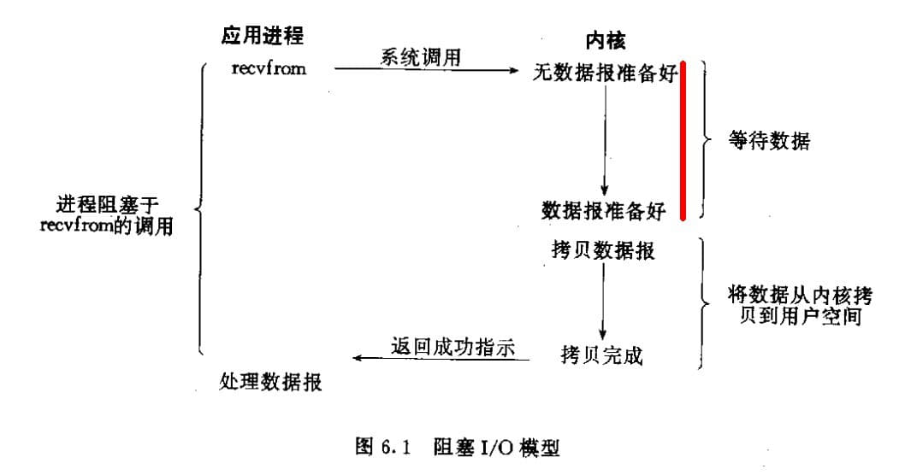

# [转]ab、wrk、JMeter、Locust这些压测工具的并发模型差别

### 选择压测工具是在选什么？

压力测试是测试工程师日常工作中一项比较“有技术含量”的工作，很多人都对这项工作充满了好奇。除了少数特殊场景得靠是自己开发压测脚本外，大部分压测工作是可以选用成熟的压测工具来进行的。压测工具有非常多，有开源的、有商业化的，我下面罗列一些常见的：

| 工具          | 项目地址                                           |
| :------------ | :------------------------------------------------- |
| ApacheBench   | https://httpd.apache.org/docs/2.4/programs/ab.html |
| wrk           | https://github.com/wg/wrk                          |
| Apache JMeter | https://jmeter.apache.org/                         |
| Locust        | https://locust.io/                                 |
| K6            | https://k6.io/                                     |
| Artillery     | https://artillery.io/                              |

除了LoadRunner这种商业压测工具之外，大部分测试人员在压测工具的选型时最重要的一点：**是否熟悉**。这种**熟悉**往往是出于过往的工作经历、身边同事的推荐、网上教程的多寡、脚本语言等因素。比如我在很多年前开始用`Locust`时，就是因为我个人擅长`Python`开发语言，即便在当时几乎没有中文教程。

但我在使用`Locust`一段时间之后，大约在2015年中，我意识到`Locust`作为一款压测工具，其能够产生的压力好像远远逊色于`JMeter`之类，于是开始关注压测工具背后的并发模型，去理解不同压测工具运行逻辑，尝试去解释我看到的性能差异。

### 同步、异步、阻塞、非阻塞

要讲并发模型，我们绕不开以下四个名词：

- 同步（Synchronous）
- 异步（Asynchronous）
- 阻塞 (Blocking)
- 非阻塞（Nonblocking）

而且我还要特地指出：**目前你能通过搜索引擎找到的、能准确解释这四个概念的中文资料，是极少的。**

我这边不会班门弄斧地来解释这四个词的差别，只是提一些大部分资料中忽视的点：

- 要区分同步、异步，必须讲清楚其所处的层，比如框架、用户空间、内核、IO模型
- **同步**调用发起后，没有得到结果不返回，那么毫无疑问就是**被阻塞**了
- **异步**调用发起后直接返回，毫无疑问，这个进程没有**被阻塞**

在**Operating System Concepts [9th Edition]**该书中描述对进程间通信进行了一些描述

也就是说，站在进程通信纬度上来看，阻塞、非阻塞与同步、异步是同义词，但是需要区分发送方、接收方：

- 阻塞发送
- 非阻塞发送
- 阻塞接受
- 非阻塞接受

**上述不同类型的发送方法和不同类型的接收方法可以自由组合**

另外，我们还知道Linux有五种I/O模型：

1. 阻塞式IO（Blocking I/O）
2. 非阻塞式IO（Nonblocking I/O）
3. IO复用（I/O multiplexing）
   - select
   - poll
   - epoll
4. 信号驱动式IO（Signal Driver I/O）
5. 异步IO（Asynchronous I/O）
   - AIO

**以上1-4其实都是同步IO，只有第五种模型才是异步IO**

了解以上这些概念后，我们再来讲讲文章标题中提到的这些压测工具背后的并发模型

### 基于多线程并发的ab、JMeter

ab、JMeter分别是用C、Java开发的、基于多线程并发模型的压测工具，也是目前最流行的开源压测工具，两者的工作原理类似，如下图：

- 不管ab还是JMeter，其所谓的虚拟用户(vuser)就是对应一个线程
- 在单个线程中，每个请求（query）都是同步调用的，下一个请求要等待前一个请求完成才能进行
- 一个请求（query）分成三部分：
  - send - 施压端发送开始，直到承压端接收完成
  - wait - 承压端接收完成开始，直至业务处理结束
  - recv - 承压端返回数据，直至施压端接收完成
- 同一线程中连续的两个请求之间存在**等待时间**这种概念，即图中的空白处

**在多线程并发模型下，是不是可以通过不断增加线程数量生产出更大的压力？**

答案是否定的。

事实上一个进程在一个时间点只能执行一个线程，而所谓的**并发**是指在进程里不断切换线程实现了看上去的多个任务的**并发**，但是线程上下文切换有很高的成本，过多的线程数反而会造成性能的严重下滑。

从应用角度来看，基于多线程的并发模型，往往需要设置**最大并发数**参数，而如果压测场景需要不断往上加压，那这类工具其实挺难应付的。

### wrk为什么比ab快？

wrk是一款很类似ab的压测工具，同样是使用C语言开发，不过更加的『现代化』：

> wrk is a modern HTTP benchmarking tool capable of generating significant load when run on a single multi-core CPU. It combines a multithreaded design with scalable event notification systems such as epoll and kqueue.

我们通过wrk的执行参数来来解释其并发模型：

- connections: Connections to keep open
- threads: Number of threads to use

wrk的`connections`接近ab的`concurrency`的概念，见：https://github.com/wg/wrk/issues/205

但是在ab中，`concurrency`即线程数，而wrk却有单独的`threads`参数。

wrk为了提升吞吐能力，使用基于epoll的IO复用模型，可以参考下图（图中实际为select），**同时为了减少线程的上下文切换，官方建议thread的数量等同CPU核数**，即每一个processor下只运行一个线程，这样来彻底了摆脱了线程切换的消耗。

注意了，在这种模型下，施压端发起请求是阻塞的，它需要等待多个请求一起发送，但是在接收时却是非阻塞的。

**基于这种并发模型的wrk一定会比ab、jmeter这类强吗？**

答案是不一定。I/O复用不是银弹，它并不一定适用所有的压测场景。外网有wrk、jmeter的对比测试，可以看下这两种压测更适合哪些场景：

wrk没有比JMeter更流行的原因可能是缺少GUI，同时起脚本使用`lua`语言，又比较小众。

### Locust、Artillery身后的libuv

Locust是用Python开发的分布式压测工具，近年来在国内比较流行。Locust并不是基于Python的多线程，而是coroutine（协程，gevent提供），gevent使用了`libev`或者`libuv`作为eventloop。

所谓的evetloop（事件循环）可以看下面这张图来加深理解：

这里介绍另外个压测工具Artillery，熟悉的人应该比较少，它是基于Node.js开发的。

这里为什么把它跟Locust归到一起来介绍？了解Node.js的人想必已经知道原因了：底层的`libuv`提供了极强悍的异步IO能力。

其事件循环逻辑：

想深入了解libuv可以参考官方文档，这里不多展开了：http://docs.libuv.org/en/v1.x/design.html

**不过就我实在使用经验来看，Locust所能产生的并发匪夷所思的低，该问题有很多人向官方反馈过（包括我自己），我不确定到目前版本该问题是否已经根除。在你不确定的情况下，请谨慎使用Locust，包括其分布式执行模式。**

### 横向比较这些压测工具

在我写这篇文章搜索资料之时，意外发现`k6.io`的blog上有目前已知压测工具的综合对比，非常完善，可以直接戳这里：https://k6.io/blog/comparing-best-open-source-load-testing-tools

对于这些开源的压测工具，我的观点：

- JMeter能够应付大部分压测场景，即便多线程并发模型不是最高效的
- 如果你的压测场景中，需要不断往上加压，请尝试基于异步API的压测工具，多线程并发满足不了需求
- 如果你不满足以上工具，请接着往下看

### one more thing - Ultron

除上面介绍的这些并发模型之外，我相信很多人听过Golang下的goroutine：

- goroutine可以理解是用户态线程，goroutine的切换没有内核开销
- 内存占用小，线程栈空间通常是 2M，goroutine 栈空间最小 2K
- G-M-P调度模型

golang为并发而生，go项目在未经优化的情况下就有很高的并发能力，有人曾经调侃，十年经验的cpp程序员用各种黑魔法写出来的服务也未必有golang项目的高并发能力。（ 一个段子而已，不要太当真）

那goroutine这么强，那有没有基于goroutine的开源压测工具？

**开始带货了**

我这里推荐下ultron这个项目: https://github.com/qastub/ultron

- 基于goroutine的高并发能力，在与wrk、jmeter等工具的对比测试中，并发能力超出jmeter，仅次于wrk
- goroutine提供的是同步函数的语义，理解简单
- 对请求（或事务）进行了高度抽象，方便接入各种协议
- 提供了Result、Report事件监听接口，方便扩展，如内置了对Influxdb的支持，可以实时生成报告

------

**参考资料：**

- [怎样理解阻塞非阻塞与同步异步的区别？](https://www.zhihu.com/question/19732473/answer/241673170)
- [JMeter VS WRK](https://medium.com/@malith.jayasinghe/jmeter-vs-wrk-9b8d307ecdff)
- [Comparing the best open source load testing tools since 2017!](https://k6.io/blog/comparing-best-open-source-load-testing-tools)
