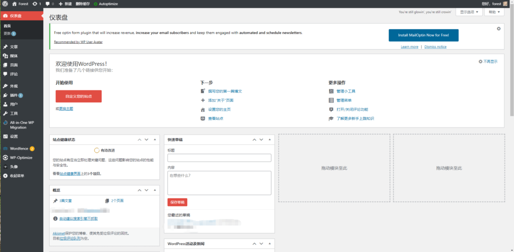
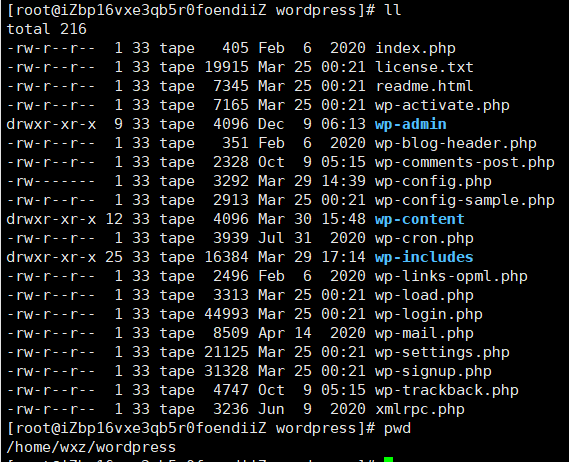
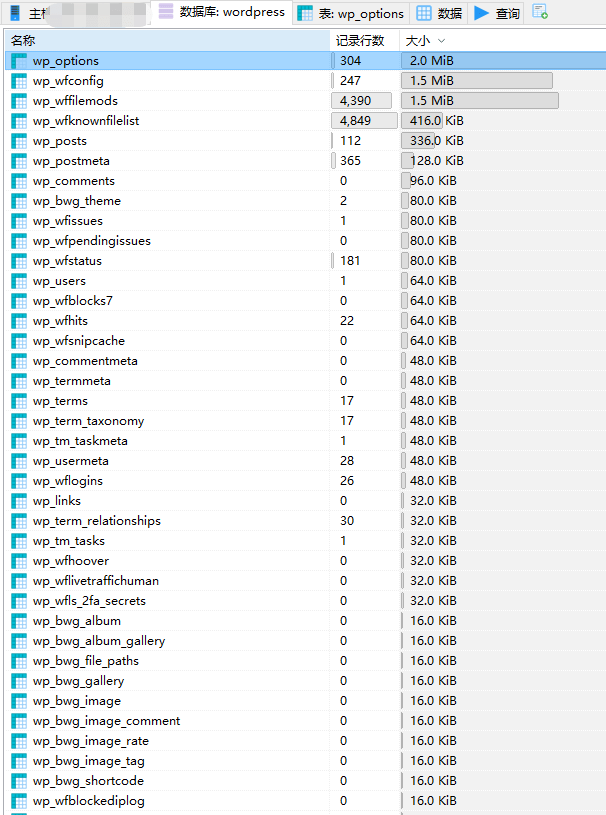

# 弄个wordpress玩玩


## 一、下载wordpress镜像并启动容器

```
# docker pull wordpress
# docker run --name mywordpress -e WORDPRESS_DB_HOST=IP:3306 -e WORDPRESS_DB_USER=**** -e WORDPRESS_DB_PASSWORD=****** -e WORDPRESS_DB_NAME=wordpress -p 8080:80 -v /home/wxz/wordpress:/var/www/html -d wordpress
```

由于我的数据库也是docker启动的，配置mysql的IP时不能使用localhost，需要使用内网IP，否则俩容器间不能正常连接。

容器启动成功后在阿里云开启80端口，可访问成功。首次访问要注册管理员账号，并简单配置。

wordpress仪表盘



wordpress文件目录



数据库目录



## 二、挑选wordpress主题、插件，开始整活

主题：

> [Dashscroll](https://alx.media/)

在用的插件：

> **Akismet 反垃圾评论**
>
> **All-in-One WP Migration**：所有博客数据的迁移工具。 只需点击一下即可导入或导出您的博客内容。
>
> **Disable Gutenberg**
>
> **Autoptimize**
>
> **Download Free Images**
>
> **Enhanced Media Library**
>
> **QQWorld自动保存图片**自动保存远程图片到本地，自动设置特色图片，并且支持机器人采集软件从外部提交。
>
> **Wordfence安全**：Wordfence安全 - 防病毒，防火墙和恶意软件扫描
>
> **WP Githuber MD**：一个为 WordPress 网站提供全功能 Markdown 语法的插件。
>
> **WP-Optimize - Clean, Compress, Cache**：WP-Optimize使您的网站快速高效。 它清理数据库，压缩图像并缓存页面。 加速站点吸引更多的流量和用户。
