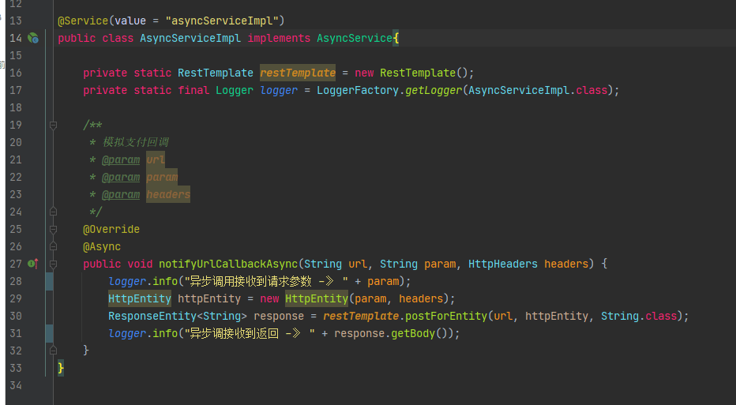

# 微信支付mock


## 一、背景介绍&方案制定

公司的支付系统主要走微信支付，其他还有支付宝、无感支付、余额支付、线下现金支付。要开展自动化测试所以需要从接口层面打通支付流程。


```html
1、先从简单的微信扫车位码缴费接口开始整活，其本质是扫码后跳转微信公众号缴费。使用fiddler抓包获取其整个接口调用链。
2、根据接口调用链review研发代码，抓取服务器关键日志，理清订单支付逻辑，分析和微信支付的交互点主要在于下面三部分。
    1）调用微信统一下单接口在微信支付服务后台生成预支付交易单。
    2）支付完成后微信把相关支付结果及用户信息通过回调接口发送给我们。
    3）调用微信查询订单接口查询订单状态。
3、需要mock一个服务器模拟微信支付服务后台，提供统一下单、查询订单接口，以及调用回调接口通知缴费成功。
```

## 二、整活细节

####  virtualXposed 安装微信抓包

使用fiddler抓包。测试环境公众号H5页面使用的http协议可以直接抓，但是后面要抓小程序的包，安卓7微信7以上版本由于证书信任问题小程序无法直接抓包，所以用virtualXposed把微信装到虚拟机里再抓包。


#### 直接调用服务器接口，忽略网关

由于vpn的原因云服务器的端口都是通的，可以直接访问，所以调用接口的时候可以直接调用服务接口，省掉加密验证关卡，脚本写起来方便简洁很多。

#### 方案一、通过jumpssh、SSH Command抓取服务器日志组装参数调用回调接口

前端调用下单接口后，后台服务器会根据该笔订单入场时间、车场计费规则、车牌欠费记录、用户信息等数据组装参数调用微信统一下单接口，这部分信息分散在各处但是会在日志中打印出来，通过直接抓服务器日志正则表达式取参数值的方式组装接口调用参数。

python用的jumpssh开发抓取服务器日志代码。运维给的jumpserver堡垒机账号，先登陆堡垒机账号再跳转到服务器上，尝试了很久发现无法实现跳转到服务器上执行命令，估计是堡垒机上权限不够，所以悄悄自己建了个账号，只给了日志目录查看权限。


jmeter版用 SSH Command 实现。


#### 方案二、mock 微信支付服务后台服务提供接口

mock微信支付服务后台接口，异步调用回调接口。




方案二、通过脚本在jenkins拉取代码后修改代码再编译

通过脚本修改微信支付域名、注释签名验证。


