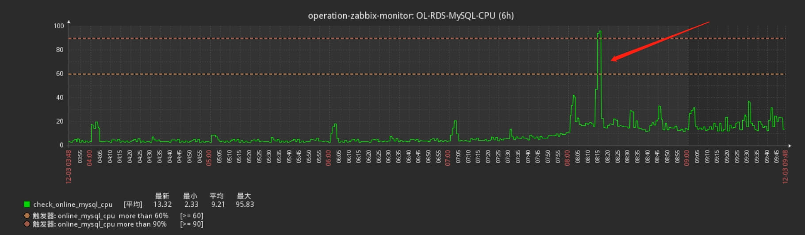
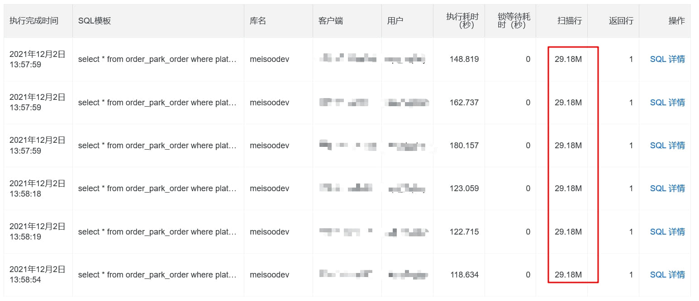
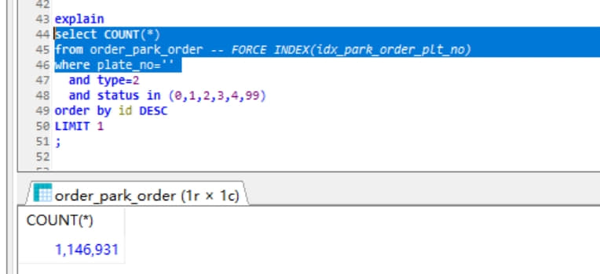
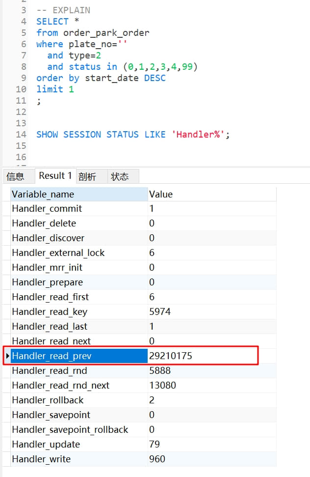
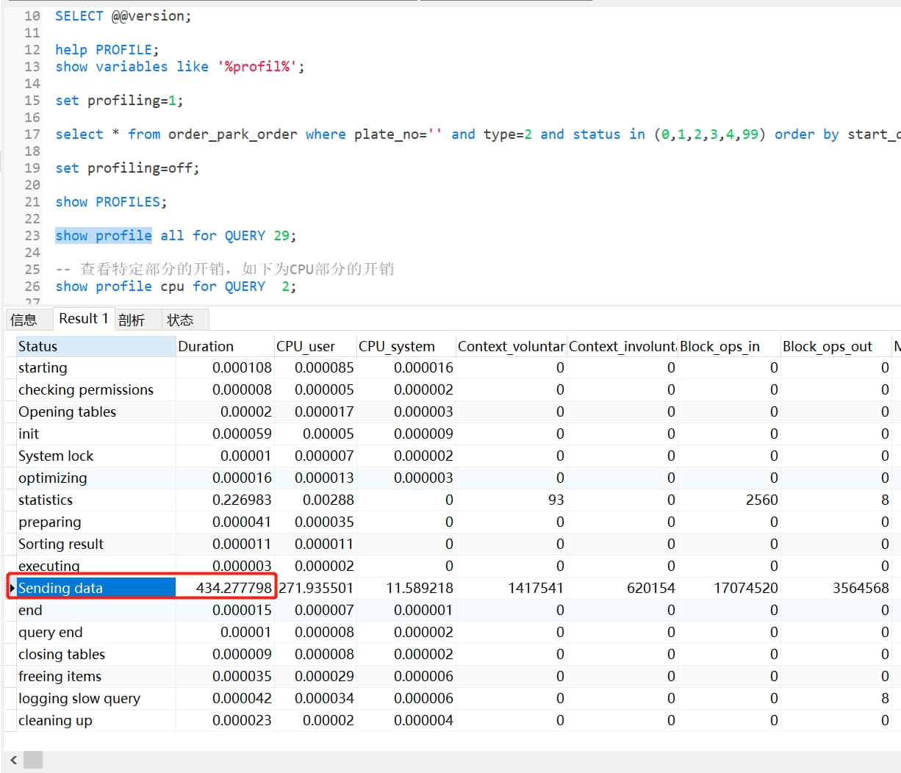
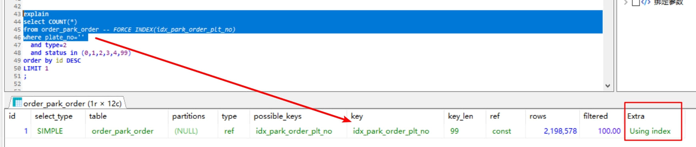
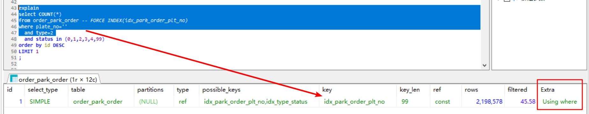

# [慢SQL分析]数据量过大导致优化器使用错误索引


# 数据量过大导致优化器使用错误索引

1、线上告警：CPU接近跑满，突破“严重”级别阈值


2、问题SQL：抓取今早 08:16 分慢查询如下


```sql
select * 
from order_park_order 
where plate_no='' 
 and type=2 
 and status in (0,1,2,3,4,99) 
order by start_date desc 
limit 1;
```

扫描订单表行数接近全表数据（约三千万），估计很大可能性是走的全表扫描。

3、查看SQL的执行计划：
走的是全索引扫描index类型（注意不是索引查找如ref、range类型等，index类型比all类型即全表扫描好不到哪儿去），使用的竟然是start_date字段上的索引，而且扫描行数才13行就离谱。


这是因为explain工具本局限性，特别对如有limit的语句支持不够好，有时候统计并不准确。
对于innodb引擎，可以使用下面语句来获取实际扫描行数：



注意上面的 Handler_read_prev 含义参见官方文档：
https://dev.mysql.com/doc/refman/5.7/en/server-status-variables.html#statvar_Handler_read_prev
The number of requests to read the previous row in key order. This read method is mainly used to optimize ORDER BY ... DESC.
含义就是在进行索引扫描时，按照索引倒序从数据文件里取数据的次数（一般就是有 ORDER BY ... DESC 的情况)
亦即实际扫描行数和慢查询日志里面的是相符的，都是接近三千万的全表数据量，而不是explain里面展示的仅仅13条。

4、原SQL的耗时由此估计也是集中在过程中数据的回表处理，通过查看SQL的执行过程可以进一步确认：

原SQL在测试环境执行一次需要4百多秒（低于线上配置），可以看到绝大部分耗时都是在 Sending data
特别注意 Sending data 不是字面上的发送数据，而是包括收集（主要是回表)+发送数据
这里加了limit，耗时主要就是在过程中的数据收集上，亦即前面分析的走到错误的 start_date 索引上导致的回表进行全表数据操作

5、为什么会走到 start_date 上的索引？
应该是优化器被 order by 给误导，优化器本意是利用索引的有序性，省去排序的成本，但这只是一方面。
分析原SQL的where条件，where条件中只有 plate_no 有索引：
（1）当where条件只有plate_no时，是可以用到索引的，执行还是很快的：

注意上面的是 Using index 
（2）当where条件不只有plate_no时，仍然可以用到索引，但执行变得很慢了：

注意上面的 Using where ，与上面 Using index 区别， 表示因为索引 idx_park_order_plt_no 只包含 (plate_no,id)列，只通过该索引是没办法判断type=2条件的，因而会有通过索引收集到的一批id去返回数据文件取数据（回表）。
（3）为什么加了type=2就变慢了呢？除了回表操作，还因为数据量的影响：
where 条件 plate_no='' 实际数据量有100多万，也就是说差不多要回表获取百万计的行


总结：因为即使应用了正确索引但条件筛选的数据量大，再加上索引不能覆盖where条件的其他字段，导致发生回表的大量数据操作，本身成本较高！更糟糕的是，在成本较高的情况下，因为需要进行order by倒序的诱导，优化器后又进一步选择了错误的 start_date 索引上，最后的结果是性能更低！！如此多方面因素，造成了这样的情况结果。
