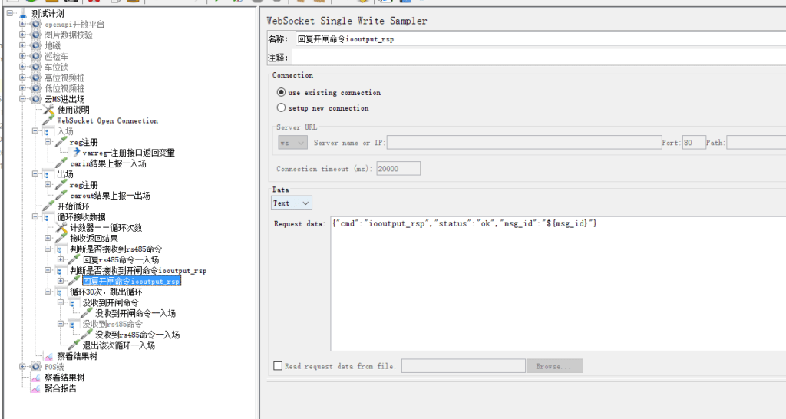

# 记一次全链路性能测试

## 一、背景介绍

## 二、准备工作

## 三、用Jmeter开始整活

### 3.1 数据准备

数据准备部分1、调用创建运营主体接口，对运营主体名称打标“test压力测试${__time(yyyyMMdd,)}”，方便后期维护数据，考虑到一般压测时间不会跨天，用yyyyMMdd区隔压测数据，可扩展成yyyyMM区隔。

2、需要获取运营主体id，接口未返回，调用JDBC Request，查询出id并保存到vars中。

3、调用创建车场接口，对车场名打标“test压力测试${code}”。需要获取车场id，接口未返回，调用JDBC Request查询出id并保存到vars中。

4、调用创建场内区域接口，同样对区域名称打标“压力测试${code}”。需要获取区域id，接口未返回，调用JDBC Request查询出id并保存到vars中。

5、调用创建车位接口，一个车场创建30个车位。

查询数据库数据1个车场车位数一般在32个左右

6、调用创建收费规则接口，有“遂宁资费”、“沙坪坝资费”两种类型资费比较典型，可分别压测。同样的资费名打标“test性能测试”。需要资费id，接口返回了，用正则表达式提取器提取。

7、将车场和收费规则关联，收费员和车场关联，涉及大量字符串处理，先手动在平台上操作。

### 3.2、地磁部分（高位视频、低位视频流程类似）

#### 3.2.1、数据准备

1、调用地磁注册接口，对设备编号打标，保持和车位号一致“${code}”。需要获取地磁id，接口未返回，调用JDBC Request查询出id并保存到vars中。

2、需要车位id，调用JDBC Request根据车位号“${code}”查询出车位id并保存到vars中。

3、调用地磁绑定接口，将地磁设备和车位号绑定。

#### 3.2.2、场景构建

1、地磁入场后立刻离场——未产生资费：调用地磁入场接口后等待5秒，调用地磁离场接口。

2、地磁入场后欠费离场：调用地磁入场接口后等待1分10秒，产生资费，调用地磁离场接口（自费规则设置的免停时长1分钟）。

3、地磁入场后现金缴费离场：调用地磁入场接口后等待1分10秒，产生资费，调用现金支付接口，调用地磁离场接口。

4、地磁入场后微信线上缴费离场：调用地磁入场接口后等待1分10秒，产生资费，调用微信支付回调接口，调用地磁离场接口。

5、以上几种场景根据实际业务情况使用循环控制器按比例配置请求次数。

### 3.3、POS机部分

#### 3.3.1、进出场缴费场景构建

1、POS入场后欠费离场

2、POS入场后异常离场

3、POS入场后现金缴费离场

4、POS入场后微信扫码支付缴费离场

#### 3.3.2、欠费补缴、预付费场景构建

1、POS入场后欠费离场，扫小票二维码补缴欠费。

2、POS入场后欠费离场，H5页面输入车牌补缴欠费。

3、POS入场后欠费离场，通过小程序补缴欠费。

4、POS入场后现金缴纳预付费，费用未消耗完退费离场。

5、POS入场后线上缴纳预付费，费用未消耗完自动退费离场。

6、POS入场后线上缴纳预付费，费用消耗完产生新的资费缴费离场。

### 3.4、云MS摄像头进出场压测

该摄像头通过websocket协议与服务器连接。

摄像头注册

入场

初始化循环控制器、循环判断控制器

循环接受返回结果

接收到开闸命令返回开闸

## 监控
## 调优
